---
## Front matter
title: "Отчёт по лабораторной работе №2"
subtitle: "Дисциплина: архитектура компьютера"
author: "Репкина Елизавета Андреевна"

## Generic otions
lang: ru-RU
toc-title: "Содержание"

## Bibliography
bibliography: bib/cite.bib
csl: pandoc/csl/gost-r-7-0-5-2008-numeric.csl

## Pdf output format
toc: true # Table of contents
toc-depth: 2
lof: true # List of figures
lot: true # List of tables
fontsize: 12pt
linestretch: 1.5
papersize: a4
documentclass: scrreprt
## I18n polyglossia
polyglossia-lang:
  name: russian
  options:
	- spelling=modern
	- babelshorthands=true
polyglossia-otherlangs:
  name: english
## I18n babel
babel-lang: russian
babel-otherlangs: english
## Fonts
mainfont: IBM Plex Serif
romanfont: IBM Plex Serif
sansfont: IBM Plex Sans
monofont: IBM Plex Mono
mathfont: STIX Two Math
mainfontoptions: Ligatures=Common,Ligatures=TeX,Scale=0.94
romanfontoptions: Ligatures=Common,Ligatures=TeX,Scale=0.94
sansfontoptions: Ligatures=Common,Ligatures=TeX,Scale=MatchLowercase,Scale=0.94
monofontoptions: Scale=MatchLowercase,Scale=0.94,FakeStretch=0.9
mathfontoptions:
## Biblatex
biblatex: true
biblio-style: "gost-numeric"
biblatexoptions:
  - parentracker=true
  - backend=biber
  - hyperref=auto
  - language=auto
  - autolang=other*
  - citestyle=gost-numeric
## Pandoc-crossref LaTeX customization
figureTitle: "Рис."
tableTitle: "Таблица"
listingTitle: "Листинг"
lofTitle: "Список иллюстраций"
lotTitle: "Список таблиц"
lolTitle: "Листинги"
## Misc options
indent: true
header-includes:
  - \usepackage{indentfirst}
  - \usepackage{float} # keep figures where there are in the text
  - \floatplacement{figure}{H} # keep figures where there are in the text
---

# Цель работы
Целью работы является изучить идеологию и применение средств контроля 
версий. Приобрести практические навыки по работе с системой git

# Задание

1. Настройка GitHub.
2. Базовая настройка Git. 
3. Создание SSH-ключа. 
4. Создание рабочего пространства и репозитория курса на основе шаблона. 
5. Создание репозитория курса на основе шаблона. 
6. Настройка каталога курса. 
7. Выполнение заданий для самостоятельной работы

# Теоретическое введение
Системы контроля версий. 
Общие понятия Системы контроля версий (Version Control System, VCS) 
применяются при работе нескольких человек над одним проектом. Обычно 
основное дерево проекта хранится в локальном или удалённом репозитории, 
к которому настроен доступ для участников проекта. При внесении 
изменений в содержание проекта система контроля версий позволяет их 
фиксировать, совмещать изменения, произведённые разными участниками 
проекта, производить откат к любой более ранней версии проекта, если это 
требуется.
В классических системах контроля версий используется централизованная 
модель, предполагающая наличие единого репозитория для хранения файлов. 
Выполнение большинства функций по управлению версиями осуществляется 
специальным сервером. Участник проекта (пользователь) перед началом 
работы посредством определённых команд получает нужную ему версию 
файлов. После внесения изменений, пользователь размещает новую версию в 
хранилище. При этом предыдущие версии не удаляются из центрального 
хранилища и к ним можно вернуться в любой момент. Сервер может 
сохранять не полную версию изменённых файлов, а производить так 
называемую дельта-компрессию — сохранять только изменения между 
последовательными версиями, что позволяет уменьшить объём хранимых 
данных. 
Системы контроля версий поддерживают возможность отслеживания и 
разрешения конфликтов, которые могут возникнуть при работе нескольких 
человек над одним файлом. Можно объединить (слить) изменения, 
сделанные разными участниками (автоматически или вручную), вручную 
выбрать нужную версию, отменить изменения вовсе или заблокировать 
файлы для изменения. В зависимости от настроек блокировка не позволяет 
другим пользователям получить рабочую копию или препятствует 
изменению рабочей копии файла средствами файловой системы ОС, 
обеспечивая таким образом, привилегированный доступ только одному 
пользователю, работающему с файлом.
Системы контроля версий также могут обеспечивать дополнительные, более 
гибкие функциональные возможности. Например, они могут поддерживать 
работу с несколькими версиями одного файла, сохраняя общую историю 
изменений до точки ветвления версий и собственные истории изменений 
каждой ветви. Кроме того, обычно доступна информация о том, кто из 
участников, когда и какие изменения вносил. Обычно такого рода 
информация хранится в журнале изменений, доступ к которому можно 
ограничить. 
В отличие от классических, в распределённых системах контроля версий 
центральный репозиторий не является обязательным. 
6
Среди классических VCS наиболее известны CVS, Subversion, а среди 
распределённых — Git, Bazaar, Mercurial. Принципы их работы схожи, 
отличаются они в основном синтаксисом используемых в работе команд.

# Выполнение лабораторной работы

Настройка GitHub
Создаю учетную запись на сайте GitHub (рис. [-@fig:001]):

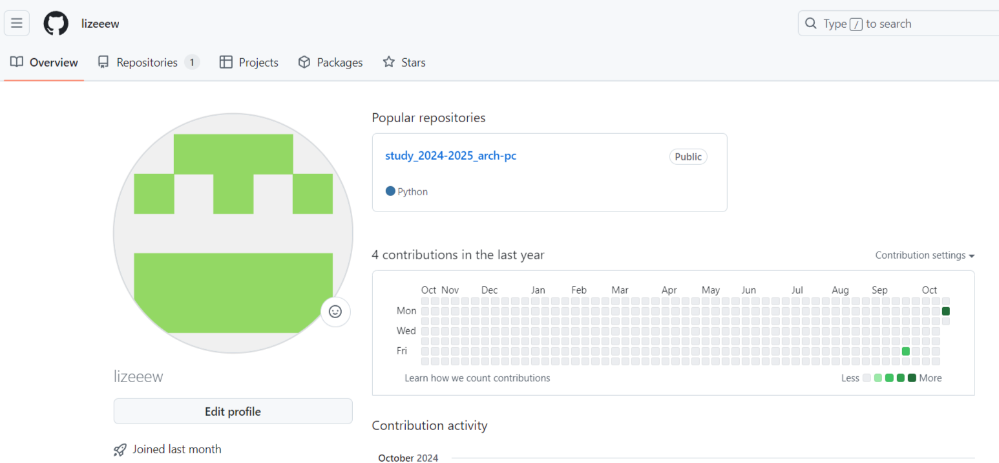{#fig:001 width=70%}

Базовая настройка Git 
Открываю терминал и ввожу команды, указав имя и email владельца 
репозитория (рис. [-@fig:002]):

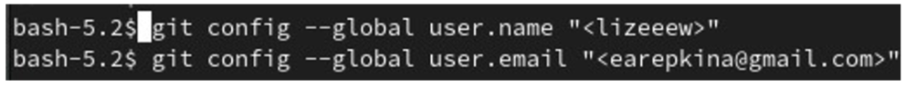{#fig:002 width=70%}

Настраиваю utf-8 в выводе сообщений git (рис. [-@fig:003]):

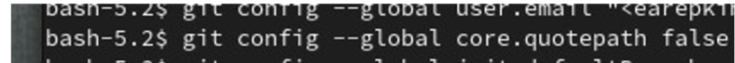{#fig:003 width=70%}

Задаю параметр safecrlf (рис. [-@fig:004]): 

{#fig:004 width=70%}

Создание SSH ключа 
Для последующей идентификации пользователя на сервере репозиториев необходимо генерирую пару ключей (приватный и открытый) (рис. [-@fig:005]):

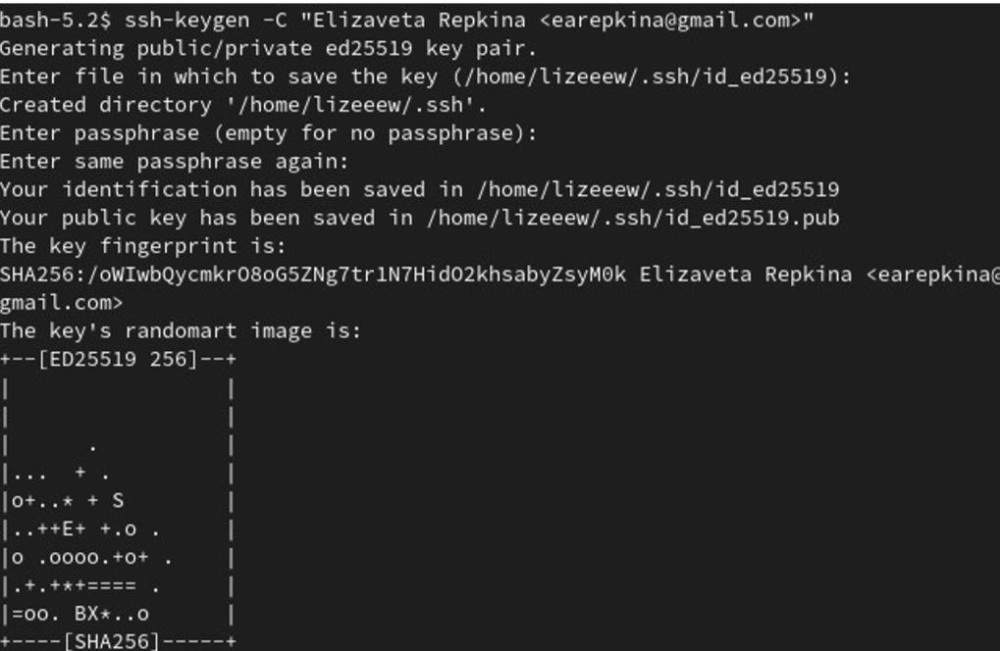{#fig:005 width=70%}

Далее загружаю  сгенерённый открытый ключ. Для этого захожу на сайт http://github.org/ под своей учётной записью и перехожу в меню Setting . После этого выбираю в боковом меню SSH and GPG keys и нажать кнопку New SSH key . Скопировав из локальной консоли ключ в буфер обмена cat ~/.ssh/id_rsa.pub | xclip -sel clip вставляю ключ в появившееся на сайте поле и указываю для ключа имя (Title).(рис. [-@fig:006]): (рис. [-@fig:007]): 

{#fig:006 width=70%}

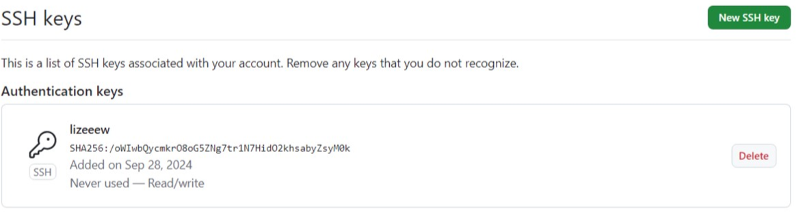{#fig:007 width=70%}

Создание рабочего пространства и репозитория курса на основе шаблона 
 
Открываю терминал и создаю каталог для предмета «Архитектура компьютера» (рис. [-@fig:008]):

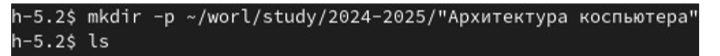{#fig:008 width=70%}

Создание репозитория курса на основе шаблона 
  
Репозиторий на основе шаблона можно создать через web-интерфейс github. 
Перехожу на станицу репозитория с шаблоном курса 
https://github.com/yamadharma/cour se-directory-student-template. Далее выбираю Use this template (рис. [-@fig:009]):
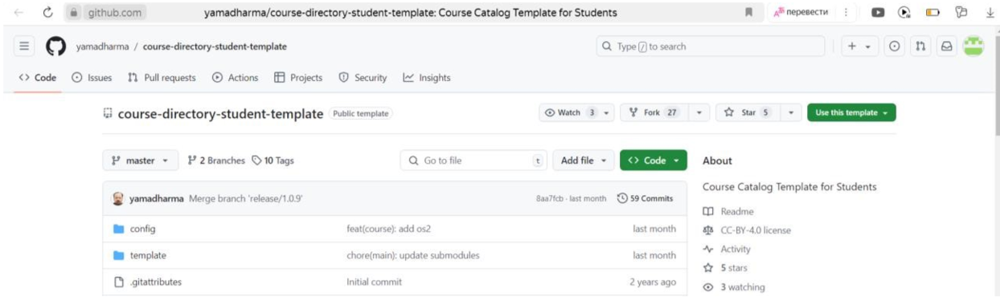{#fig:009 width=70%}

В открывшемся окне задаю имя репозитория (Repository name) study_2024– 2025_arhpc и создаю репозиторий (кнопка Create repository from template). (рис. [-@fig:010]): (рис. [-@fig:011]):

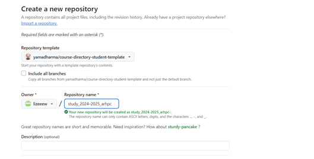{#fig:010 width=70%}

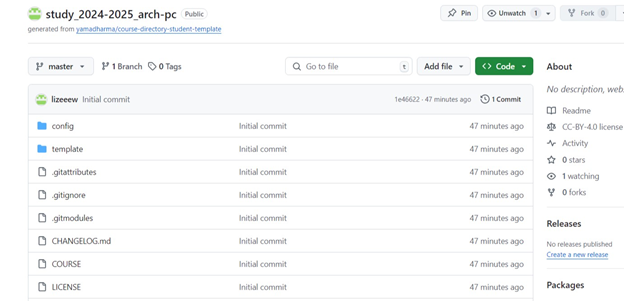{#fig:011 width=70%}

 
клонирую созданный репозиторий (рис. [-@fig:012]):
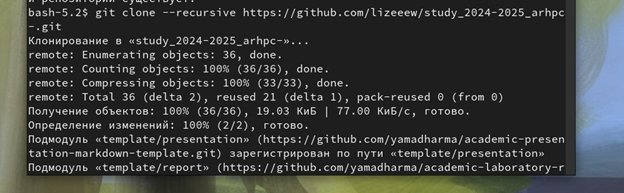{#fig:012 width=70%}

Настройка каталога курса 
Перехожу в каталог курса
Удаляю лишние файлы (рис. [-@fig:013]):
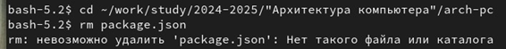{#fig:013 width=70%}

Создаю необходимые каталоги и отправляю файлы на сервер (рис. [-@fig:014]):

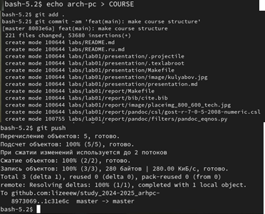{#fig:014 width=70%}

Проверяю правильность создания иерархии рабочего пространства в локальном репозитории и на странице github (рис. [-@fig:015]):

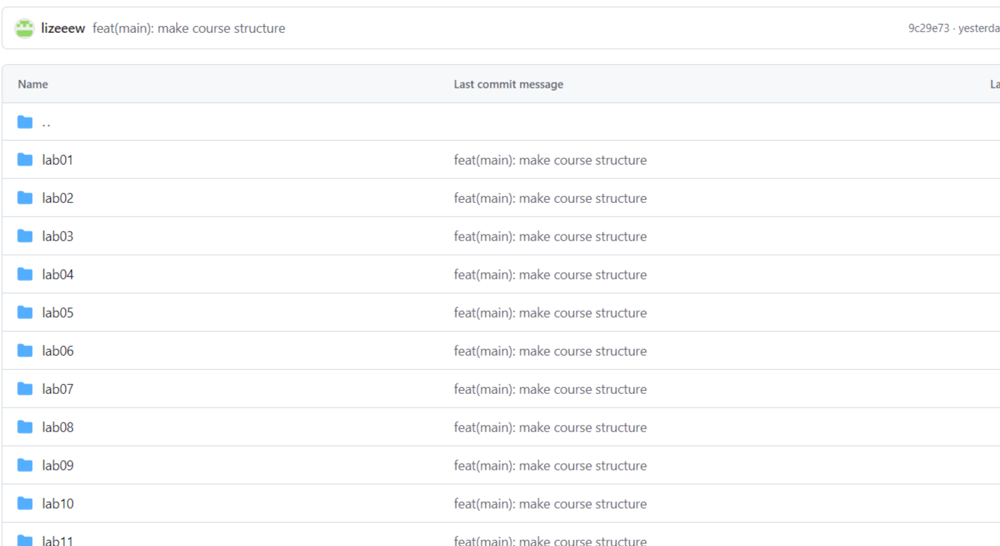{#fig:015 width=70%}

# Выполнение заданий для самостоятельной работы 

Перехожу в директорию labs/lab02/report с помощью утилиты cd. Создаю в каталоге файл для отчета по второй лабораторной работе с помощью утилиты touch. Я добавила отчет по предыдущей лабораторной работе в соответствующий каталог (рис. [-@fig:016]):

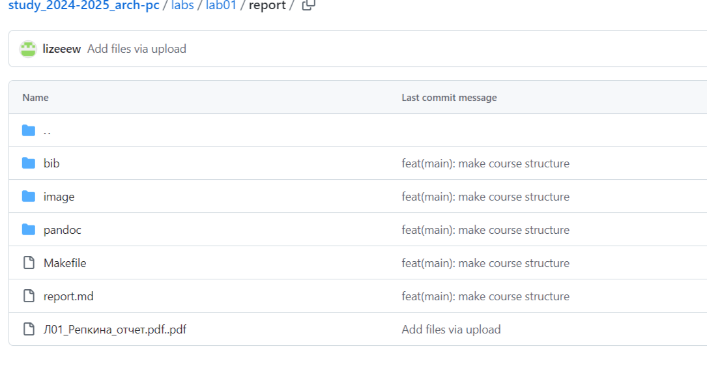{#fig:016 width=70%}

# Выводы
При выполнении данной лабораторной работы я изучила идеологию и применение средств контроля версий, а также приобрела практические навыки по работе с системой git. 

# Вопросы для самопроверки 
1	Системы контроля версий (VCS) — это программное обеспечение, которое помогает отслеживать изменения в файловой системе и эффективно управлять версиями файлов и кода в проекте. Они предназначены для решения следующих задач: Отслеживание изменений: позволяет отслеживать все изменения, сделанные в файлах проекта, включая добавление, удаление, изменение строк кода и текстовых данных. Версионирование: сохраняет изменения в виде версий, что позволяет восстанавливать предыдущие состояния проекта, откатывать изменения и переходить к определённым версиям для просмотра или восстановления кода. 
Ветвление и слияние (Branching and Merging): позволяет создавать отдельные ветки проекта, где разработчики могут работать независимо, а затем объединять свои изменения в основную ветку. 
Работа в команде: позволяет нескольким разработчикам работать над одним проектом, автоматически обнаруживая и решая конфликты при слиянии изменений. 
История изменений: подробно записывает все изменения, включая информацию о коммитах, авторах и времени внесения изменений. 
2	Хранилище (репозиторий) — это специальное место, где хранятся файлы и папки проекта. Изменения в этих файлах отслеживаются системой контроля версий (VCS). Рабочая копия — это копия проекта, с которой разработчик работает напрямую. Он вносит изменения в рабочую копию, а затем периодически синхронизирует её с хранилищем. Синхронизация включает отправку изменений, сделанных разработчиком, в хранилище (commit) и актуализацию рабочей копии с последней версией из репозитория (update). 
История — это последовательность всех изменений, которые были внесены в проект с момента его создания. Она содержит информацию о том, кто, когда и какие изменения внёс. 
Таким образом, хранилище служит местом хранения проекта, рабочая копия — инструментом для работы разработчика, а commit и update обеспечивают связь между ними и сохранение истории изменений. 
 
3	Централизованные VCS — это системы контроля версий, в которых репозиторий проекта находится на сервере, доступ к которому осуществляется через клиентское приложение. Примеры централизованных VCS: CVS (Concurrent Versions System) и Subversion (SVN). 
Децентрализованные VCS (также называемые распределёнными системами контроля версий, DVCS) хранят копию репозитория у каждого разработчика, работающего с системой. Локальные репозитории периодически синхронизируются с центральным репозиторием. Примеры децентрализованных VCS: Git и Mercurial. 
 
4	При единоличной работе с хранилищем в системе контроля версий (VCS) выполняются следующие действия: 
Создание новой папки с датой или пометкой для рабочей версии проекта. 
Копирование рабочей версии проекта в новую папку. 
Непосредственная работа с рабочей копией проекта. 
Периодическая синхронизация рабочей копии с репозиторием путём отправки изменений (commit) и актуализации рабочей копии с последней версией из репозитория (update). 
 
5	Порядок работы с общим хранилищем VCS включает следующие этапы: 
Создание репозитория: разработчик создаёт новый репозиторий, используя команды git init, hg init или аналогичные в зависимости от используемой системы контроля версий (например, Git, Mercurial). 
Внесение изменений в файлы: разработчик вносит изменения в файлы проекта, например, новые функции, исправления ошибок или другие изменения. 
Добавление файлов: разработчик добавляет файлы проекта в список подготовленных для сохранения в репозитории с помощью команды git add, hg add или аналогичной. Коммит изменений: разработчик фиксирует изменения в файлах, создавая коммит с помощью команды git commit, hg commit или аналогичной. В коммите указывается, какие файлы были изменены, и краткое описание изменений. 
Отправка изменений на сервер: разработчик отправляет изменения на сервер с помощью команд git push, hg push или аналогичных. 
6	Основные задачи, решаемые инструментальным средством Git: 
Возврат к любой предыдущей версии кода. 
Просмотр истории изменений. 
Параллельная работа над проектом. Backup кода. 
 
7	git clone — клонирование репозитория в новую директорию. git add — перенос новых и изменённых файлов в проиндексированные. git push — отправка закоммиченных файлов в удалённый репозиторий. git pull — извлечение и загрузка последней информации в локальный репозиторий. git rm — удаление файла из удалённого репозитория. 
 
8	Вот несколько примеров использования локального репозитория: 
Создание почтового аккаунта с использованием локального репозитория для хранения данных. 
Загрузка содержимого сайта с использованием локального репозитория и менеджера файлов. 
Настройка доступа к виртуальным папкам с помощью локального репозитория. 
Управление базами данных приложений с использованием локального репозитория. 
Примеры использования удалённого репозитория: 
Разработка программного обеспечения в команде: разработчики могут совместно работать над одним проектом, синхронизируя свои изменения с общим удалённым репозиторием. 
Хранение и обмен кодом: разработчики могут делиться своим кодом с другими участниками команды или сообществом, загружая его в удалённый репозиторий

# Список литературы{.unnumbered}
1. GDB: The GNU Project Debugger. — URL: https://www.gnu.org/software/gdb/.
2. GNU Bash Manual. — 2016. — URL: https://www.gnu.org/software/bash/manual/.
3. Midnight Commander Development Center. — 2021. — URL: https://midnight-commander.
org/.
4. NASM Assembly Language Tutorials. — 2021. — URL: https://asmtutor.com/.
5. Newham C. Learning the bash Shell: Unix Shell Programming. — O’Reilly Media, 2005. —
354 с. — (In a Nutshell). — ISBN 0596009658. — URL: http://www.amazon.com/Learningbash-Shell-Programming-Nutshell/dp/0596009658.
6. Robbins A. Bash Pocket Reference. — O’Reilly Media, 2016. — 156 с. — ISBN 978-1491941591.
7. The NASM documentation. — 2021. — URL: https://www.nasm.us/docs.php.
8. Zarrelli G. Mastering Bash. — Packt Publishing, 2017. — 502 с. — ISBN 9781784396879.
9. Колдаев В. Д., Лупин С. А. Архитектура ЭВМ. — М. : Форум, 2018.
10. Куляс О. Л., Никитин К. А. Курс программирования на ASSEMBLER. — М. : Солон-Пресс,
2017.
11. Новожилов О. П. Архитектура ЭВМ и систем. — М. : Юрайт, 2016.
12. Расширенный ассемблер: NASM. — 2021. — URL: https://www.opennet.ru/docs/RUS/nasm/.
13. Робачевский А., Немнюгин С., Стесик О. Операционная система UNIX. — 2-е изд. — БХВПетербург, 2010. — 656 с. — ISBN 978-5-94157-538-1.
14. Столяров А. Программирование на языке ассемблера NASM для ОС Unix. — 2-е изд. —
М. : МАКС Пресс, 2011. — URL: http://www.stolyarov.info/books/asm_unix.
15. Таненбаум Э. Архитектура компьютера. — 6-е изд. — СПб. : Питер, 2013. — 874 с. —
(Классика Computer Science).
16. Таненбаум Э., Бос Х. Современные операционные системы. — 4-е изд. — СПб. : Питер,
2015. — 1120 с. — (Классика Computer Science).

::: {#refs}
:::
