---
## Front matter
title: "Отчёт по лабораторной работе №3"
subtitle: "Дисциплина: архитектура компьютера"
author: "Репкина Елизавета Андреевна"

## Generic otions
lang: ru-RU
toc-title: "Содержание"

## Bibliography
bibliography: bib/cite.bib
csl: pandoc/csl/gost-r-7-0-5-2008-numeric.csl

## Pdf output format
toc: true # Table of contents
toc-depth: 2
lof: true # List of figures
lot: true # List of tables
fontsize: 12pt
linestretch: 1.5
papersize: a4
documentclass: scrreprt
## I18n polyglossia
polyglossia-lang:
  name: russian
  options:
	- spelling=modern
	- babelshorthands=true
polyglossia-otherlangs:
  name: english
## I18n babel
babel-lang: russian
babel-otherlangs: english
## Fonts
mainfont: IBM Plex Serif
romanfont: IBM Plex Serif
sansfont: IBM Plex Sans
monofont: IBM Plex Mono
mathfont: STIX Two Math
mainfontoptions: Ligatures=Common,Ligatures=TeX,Scale=0.94
romanfontoptions: Ligatures=Common,Ligatures=TeX,Scale=0.94
sansfontoptions: Ligatures=Common,Ligatures=TeX,Scale=MatchLowercase,Scale=0.94
monofontoptions: Scale=MatchLowercase,Scale=0.94,FakeStretch=0.9
mathfontoptions:
## Biblatex
biblatex: true
biblio-style: "gost-numeric"
biblatexoptions:
  - parentracker=true
  - backend=biber
  - hyperref=auto
  - language=auto
  - autolang=other*
  - citestyle=gost-numeric
## Pandoc-crossref LaTeX customization
figureTitle: "Рис."
tableTitle: "Таблица"
listingTitle: "Листинг"
lofTitle: "Список иллюстраций"
lotTitle: "Список таблиц"
lolTitle: "Листинги"
## Misc options
indent: true
header-includes:
  - \usepackage{indentfirst}
  - \usepackage{float} # keep figures where there are in the text
  - \floatplacement{figure}{H} # keep figures where there are in the text
---

# Цель работы

Освоение процедуры компиляции и сборки программ, написанных на ассемблере NASM

# Задание

1. Создание программы Hello world!
2. Работа с транслятором NASM
3. Работа с расширенным синтаксисом командной строки NASM
4. Работа с компоновщиком LD
5. Запуск исполняемого файла
6. Выполнение заданий для самостоятельной работы.

# Теоретическое введение

Основными функциональными элементами любой электронной вычислительной машины (ЭВМ) являются центральный процессор, память и периферийные устройства. Все эти компоненты взаимодействуют друг с другом через общую шину, к которой они подключены. Физически шина представляет собой множество проводников, соединяющих различные устройства. В современных компьютерах эти проводники выполнены в виде электропроводящих дорожек на материнской плате.

Центральный процессор (ЦП) выполняет обработку информации и координирует работу всех узлов компьютера. Он состоит из следующих основных компонентов:
- Арифметико-логическое устройство (АЛУ): выполняет логические и арифметические операции, необходимые для обработки данных, хранящихся в памяти.
- Устройство управления (УУ): отвечает за управление всеми устройствами ЭВМ.
- Регистры: это сверхбыстрая память небольшого объема, используемая для временного хранения промежуточных результатов выполнения инструкций. Регистры делят на два типа: общего назначения и специальные.

Для программирования на ассемблере важно знать, какие регистры существуют и как ими пользоваться. В большинстве команд, написанных на ассемблере, используются регистры в качестве операндов. Основные операции представляют собой преобразование данных, хранящихся в регистрах, такие как перенаправление данных между регистрами и памятью или выполнение арифметических и логических операций. Доступ к регистрам осуществляется по именам, а не по адресам, как в основной памяти. Каждый регистр процессора архитектуры x86 имеет имя, состоящее из двух или трех букв латинского алфавита. Примеры регистров общего назначения:
- 64-битные: RAX, RCX, RDX, RBX, RSI, RDI
- 32-битные: EAX, ECX, EDX, EBX, ESI, EDI
- 16-битные: AX, CX, DX, BX, SI, DI
- 8-битные: AH, AL, CH, CL, DH, DL, BH, BL

Другим важным компонентом ЭВМ является оперативное запоминающее устройство (ОЗУ). Это быстродействующее энергозависимое хранилище, которое взаимодействует с центральным процессором и используется для хранения программ и данных, находящихся в активной работе. ОЗУ состоит из одинаковых пронумерованных ячеек памяти, каждая из которых имеет свой адрес.

Периферийные устройства ЭВМ можно разделить на следующие группы:
- Устройства внешней памяти: предназначены для долговременного хранения больших объемов данных.
- Устройства ввода-вывода: обеспечивают взаимодействие ЦП с внешней средой.

В основе работы ЭВМ лежит принцип программного управления, что означает, что компьютер решает задачу, выполняя последовательность действий, записанных в программе. Код машинной команды состоит из множества двоичных значений (0 и 1) и можно выделить две основные части: 
1. Операционную часть, которая содержит код команды для выполнения.
2. Адресную часть, где хранятся данные или адреса, участвующие в операции.

Во время выполнения каждой команды процессор проходит через стандартный процесс, называемый командным циклом, который включает следующие шаги:
1. Формирование адреса следующей команды в памяти.
2. Считывание кода команды и ее дешифровка.
3. Выполнение команды.
4. Переход к следующей команде.

Язык ассемблера (assembly language, сокращенно asm) – это низкоуровневый язык, ориентированный на машинные команды. NASM (Netwide Assembler) является открытым проектом, предоставляющим различные версии ассемблера для разных операционных систем и позволяющим получать объектные файлы для этих систем. NASM использует синтаксис Intel и поддерживает инструкции x86-64. 

# Выполнение лабораторной работы
Программа Hello world!
Создаю каталог для работы с программами на языке ассемблера NASM и перехожу в созданный каталог (рис. [-@fig:001])

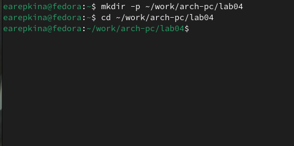{#fig:001 width=70%}

Создаю текстовый файл с именем hello.asm (рис. [-@fig:002])

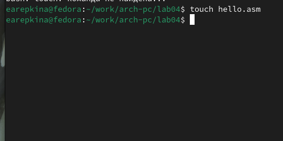{#fig:002 width=70%}

открываю этот файл с помощью любого текстового редактора, например, gedit (рис. [-@fig:003])

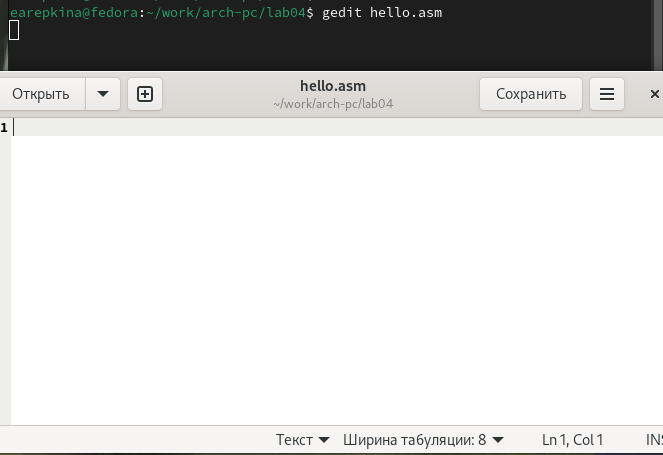{#fig:003 width=70%}

и ввожу в него текст:(рис. [-@fig:004])

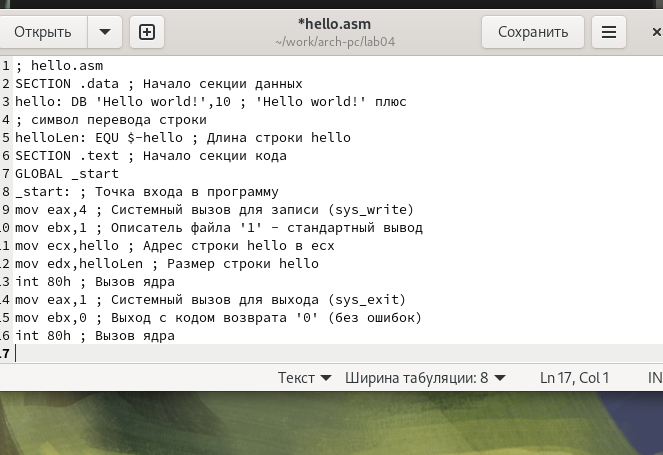{#fig:004 width=70%}

Транслятор NASM
NASM превращает текст программы в объектный код. Например, для компиляции приведённого выше текста программы «Hello World» необходимо написать nasm -f elf hello.asm и с помощью команды ls проверьте, что объектный файл был создан (рис. [-@fig:005])

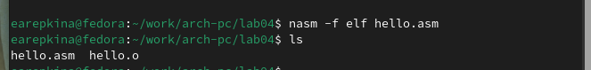{#fig:005 width=70%}

Расширенный синтаксис командной строки NASM

Выполняю указанную в задании  команду (рис. [-@fig:006])

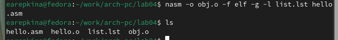{#fig:006 width=70%}

Компоновщик LD
Чтобы получить исполняемую программу, объектный файл
необходимо передать на обработку компоновщику (рис. [-@fig:007])

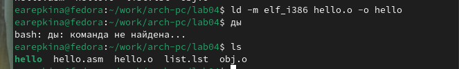{#fig:007 width=70%}

Компоновщик ld не предполагает по умолчанию расширений для файлов, но принято
использовать следующие расширения:
• o – для объектных файлов;
• без расширения – для исполняемых файлов;
• map – для файлов схемы программы;
• lib – для библиотек.
Ключ -o с последующим значением задаёт в данном случае имя создаваемого исполняемого файла.
Выполните указанную в задании команду (рис. [-@fig:008])

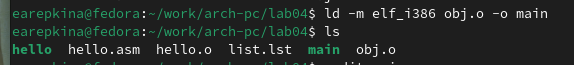{#fig:008 width=70%}
 Ответ на вопросы:
Исполняемый файл будет иметь
имя main, т.к. после ключа -о было задано значение main. Объектный файл, из
которого собран этот исполняемый файл, имеет имя obj.o

Запуск исполняемого файла(рис. [-@fig:009])

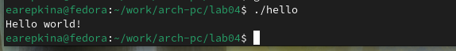{#fig:009 width=70%}

Задание для самостоятельной работы
1. В каталоге ~/work/arch-pc/lab04 с помощью команды cp создайте копию файла
hello.asm с именем lab4.asm (рис. [-@fig:010])

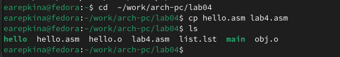{#fig:010 width=70%}

2. С помощью любого текстового редактора внесите изменения в текст программы в
файле lab4.asm так, чтобы вместо Hello world! на экран выводилась строка с вашими
фамилией и именем. (рис. [-@fig:011])

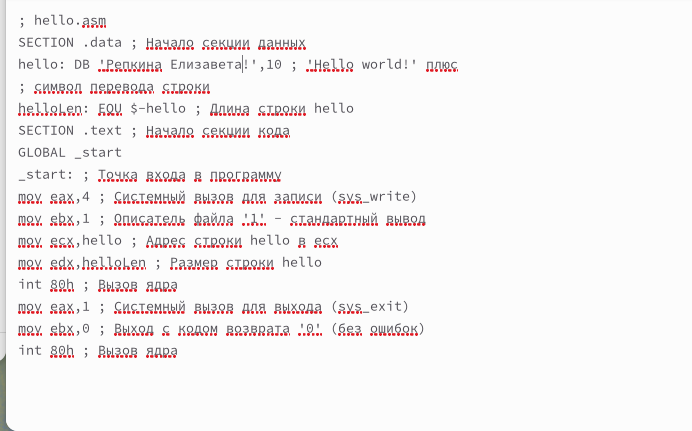{#fig:011 width=70%}

3. Оттранслируйте полученный текст программы lab4.asm в объектный файл. Выполните
компоновку объектного файла и запустите получившийся исполняемый файл. (рис. [-@fig:012])

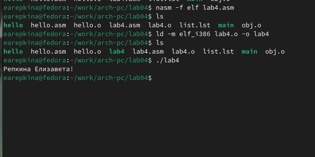{#fig:012 width=70%}

4. Скопируйте файлы hello.asm и lab4.asm в Ваш локальный репозиторий в каталог ~/work/study/2023-2024/"Архитектура компьютера"/arch-pc/labs/lab04/.(рис. [-@fig:013])

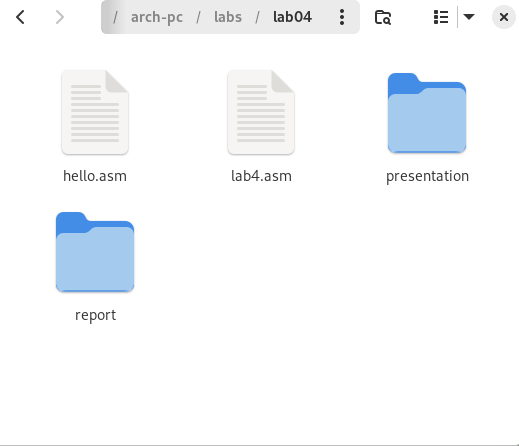{#fig:013 width=70%}

Загрузите файлы на Github. рис. [-@fig:014])

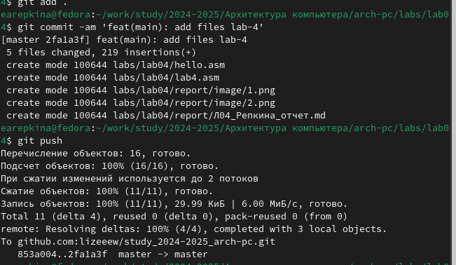{#fig:014 width=70%}
 
# Выводы

При выполнении данной лабораторной работы я освоила процедуры компиляции и сборки программ, написанных на ассемблере NASM.

# Список литературы{.unnumbered}

1. GDB: The GNU Project Debugger. — URL: https://www.gnu.org/software/gdb/.
2. GNU Bash Manual. — 2016. — URL: https://www.gnu.org/software/bash/manual/.
3. Midnight Commander Development Center. — 2021. — URL: https://midnight-commander.
org/.
4. NASM Assembly Language Tutorials. — 2021. — URL: https://asmtutor.com/.
5. Newham C. Learning the bash Shell: Unix Shell Programming. — O’Reilly Media, 2005. —
354 с. — (In a Nutshell). — ISBN 0596009658. — URL: http://www.amazon.com/Learningbash-Shell-Programming-Nutshell/dp/0596009658.
6. Robbins A. Bash Pocket Reference. — O’Reilly Media, 2016. — 156 с. — ISBN 978-1491941591.
7. The NASM documentation. — 2021. — URL: https://www.nasm.us/docs.php.
8. Zarrelli G. Mastering Bash. — Packt Publishing, 2017. — 502 с. — ISBN 9781784396879.
9. Колдаев В. Д., Лупин С. А. Архитектура ЭВМ. — М. : Форум, 2018.
10. Куляс О. Л., Никитин К. А. Курс программирования на ASSEMBLER. — М. : Солон-Пресс,
2017.
11. Новожилов О. П. Архитектура ЭВМ и систем. — М. : Юрайт, 2016.
12. Расширенный ассемблер: NASM. — 2021. — URL: https://www.opennet.ru/docs/RUS/nasm/.
13. Робачевский А., Немнюгин С., Стесик О. Операционная система UNIX. — 2-е изд. — БХВПетербург, 2010. — 656 с. — ISBN 978-5-94157-538-1.
14. Столяров А. Программирование на языке ассемблера NASM для ОС Unix. — 2-е изд. —
М. : МАКС Пресс, 2011. — URL: http://www.stolyarov.info/books/asm_unix.
15. Таненбаум Э. Архитектура компьютера. — 6-е изд. — СПб. : Питер, 2013. — 874 с. —
(Классика Computer Science).
16. Таненбаум Э., Бос Х. Современные операционные системы. — 4-е изд. — СПб. : Питер,
2015. — 1120 с. — (Классика Computer Science).

::: {#refs}
:::
