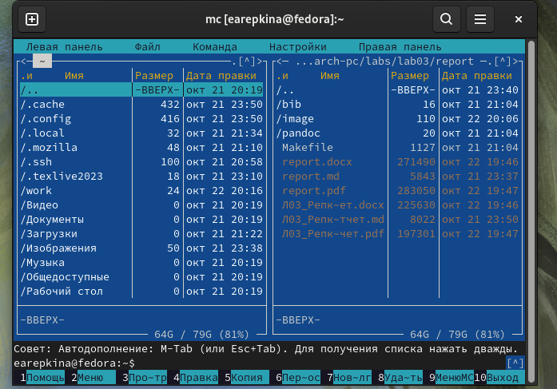
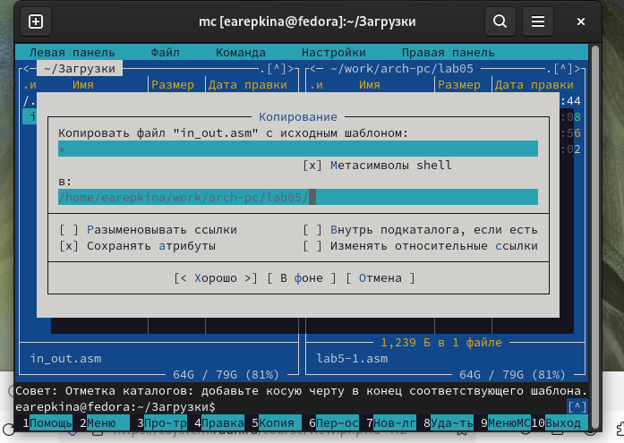

---
## Front matter
title: "Отчёт по лабораторной работе №5"
subtitle: "Дисциплина: архитектура компьютера"
author: "Репкина Елизавета Андреевна"

## Generic otions
lang: ru-RU
toc-title: "Содержание"

## Bibliography
bibliography: bib/cite.bib
csl: pandoc/csl/gost-r-7-0-5-2008-numeric.csl

## Pdf output format
toc: true # Table of contents
toc-depth: 2
lof: true # List of figures
lot: true # List of tables
fontsize: 12pt
linestretch: 1.5
papersize: a4
documentclass: scrreprt
## I18n polyglossia
polyglossia-lang:
  name: russian
  options:
	- spelling=modern
	- babelshorthands=true
polyglossia-otherlangs:
  name: english
## I18n babel
babel-lang: russian
babel-otherlangs: english
## Fonts
mainfont: IBM Plex Serif
romanfont: IBM Plex Serif
sansfont: IBM Plex Sans
monofont: IBM Plex Mono
mathfont: STIX Two Math
mainfontoptions: Ligatures=Common,Ligatures=TeX,Scale=0.94
romanfontoptions: Ligatures=Common,Ligatures=TeX,Scale=0.94
sansfontoptions: Ligatures=Common,Ligatures=TeX,Scale=MatchLowercase,Scale=0.94
monofontoptions: Scale=MatchLowercase,Scale=0.94,FakeStretch=0.9
mathfontoptions:
## Biblatex
biblatex: true
biblio-style: "gost-numeric"
biblatexoptions:
  - parentracker=true
  - backend=biber
  - hyperref=auto
  - language=auto
  - autolang=other*
  - citestyle=gost-numeric
## Pandoc-crossref LaTeX customization
figureTitle: "Рис."
tableTitle: "Таблица"
listingTitle: "Листинг"
lofTitle: "Список иллюстраций"
lotTitle: "Список таблиц"
lolTitle: "Листинги"
## Misc options
indent: true
header-includes:
  - \usepackage{indentfirst}
  - \usepackage{float} # keep figures where there are in the text
  - \floatplacement{figure}{H} # keep figures where there are in the text
---

# Цель работы

Целью данной лабораторной работы является приобретение практических
навыков работы в Midnight Commander, освоение инструкций языка ассемблера
mov и int.

# Задание

1. Основы работы с mc
2. Структура программы на языке ассемблера NASM
3. Подключение внешнего файла
4. Выполнение заданий для самостоятельной работы

# Теоретическое введение

Midnight Commander (или просто mc) — это программа, которая позволяет просматривать
структуру каталогов и выполнять основные операции по управлению файловой системой,
т.е. mc является файловым менеджером. Midnight Commander позволяет сделать работу с
файлами более удобной и наглядной.
Программа на языке ассемблера NASM, как правило, состоит из трёх секций: секция кода
программы (SECTION .text), секция инициированных (известных во время компиляции)
данных (SECTION .data) и секция неинициализированных данных (тех, под которые во
время компиляции только отводится память, а значение присваивается в ходе выполнения
программы) (SECTION .bss).
Директивы используются для объявления простых переменных и для объявления массивов. Для определения строк принято использовать директиву DB в связи с особенностями
хранения данных в оперативной памяти

# Выполнение лабораторной работы
Основы работы с mc

 Открываю Midnight Commander(рис. [-@fig:001])

{#fig:001 width=70%}

Пользуясь клавишами ↑ , ↓ и Enter перехожу в каталог ~/work/arch-pc созданный
при выполнении лабораторной работы №4 (рис. [-@fig:002])

{#fig:002 width=70%}

Структура программы на языке ассемблера NASM

С помощью функциональной клавиши F7 создаю папку lab05(рис. [-@fig:003])

{#fig:003 width=70%}

перехожу в созданный каталог(рис. [-@fig:004])

{#fig:004 width=70%}

Пользуясь строкой ввода и командой touch создаю файл lab5-1.asm (рис. [-@fig:005])

{#fig:005 width=70%}

С помощью функциональной клавиши F4 открываю файл lab5-1.asm для редактирования во встроенном редакторе. Как правило в качестве встроенного редактора Midnight
Commander используется редакторы nano  или mcedit (рис. [-@fig:006])

{#fig:006 width=70%}
 
Ввожу текст программы из листинга 5.1 (рис. [-@fig:007])

{#fig:007 width=70%}

сохраняю изменения и закрываю файл (рис. [-@fig:008])

{#fig:008 width=70%}

С помощью функциональной клавиши F3 открываю файл lab5-1.asm для просмотра.
Убеждаюсь, что файл содержит текст программы. (рис. [-@fig:009])

{#fig:009 width=70%}

Открываю файл и убеждаюсь,что файл содержит текст программы. Транслирую текст программы файла в объектный файл командой nasm -f elf lab5-1.asm.Создался объектный файл lab5-1.o. Выполняю компоновку объектного файла с помощью команды ld -m elf_i386 -o lab5-1 lab5-1.o. Создался исполняемый файл lab5-1.

Запускаю исполняемый файл. Программа выводит строку “Введите строку:”
и ждет ввода с клавиатуры, я ввожу свои ФИО, на этом программа заканчивает
свою работу (рис. [-@fig:010])

{#fig:010 width=70%}

 Подключение внешнего файла

Скачиваю файл in_out.asm со страницы курса в ТУИС. (рис. [-@fig:011])

{#fig:011 width=70%}

Копирую файл in_out.asm из каталога Загрузки в созданный каталог lab05 (рис. [-@fig:012])

{#fig:012 width=70%}

С помощью функциональной клавиши F5 копирую файл lab5-1 в тот же каталог,
но с другим именем, для этого в появившемся окне mc прописываю имя для
копии файла (рис. [-@fig:013])

{#fig:013 width=70%}

Изменяю содержимое файла lab5-2.asm во встроенном редакторе nano, чтобы
в программе использовались подпрограммы из внешнего файла in_out.asm. (рис. [-@fig:014])

{#fig:014 width=70%}

Транслирую текст программы файла в объектный файл командой nasm -f elf
lab5-2.asm. Создался объектный файл lab5-2.o. Выполняю компоновку объектного
файла с помощью команды ld -m elf_i386 -o lab5-2 lab5-2.o Создался исполняемый
файл lab5-2. Запускаю исполняемый файл.  (рис. [-@fig:015])

{#fig:015 width=70%}

Открываю файл lab5-2.asm для редактирования в nano. Изменяю в нем подпрограмму sprintLF на sprint. Сохраняю изменения и открываю файл для просмотра,
чтобы проверить сохранение действий (рис. [-@fig:016])

{#fig:016 width=70%}

Снова транслирую файл, выполняю компоновку созданного объектного файла,
запускаю новый исполняемый файл  (рис. [-@fig:017])

{#fig:017 width=70%}

Разница между первым исполняемым файлом lab6-2 и вторым lab6-2-2 в том,
что запуск первого запрашивает ввод с новой строки, а программа, которая
исполняется при запуске второго, запрашивает ввод без переноса на новую
строку, потому что в этом заключается различие между подпрограммами sprintLF
и sprint.

Выполнение заданий для самостоятельной работы

1. Создайте копию файла lab5-1.asm. (рис. [-@fig:018])

{#fig:018 width=70%}

Внесите изменения в программу  (без использования внешнего файла in_out.asm), так чтобы она работала по следующему алгоритму:
• вывести приглашение типа “Введите строку:”;
• ввести строку с клавиатуры;
• вывести введённую строку на экран. (рис. [-@fig:019])

{#fig:019 width=70%}

2. Получите исполняемый файл и проверьте его работу. На приглашение ввести строку
введите свою фамилию.(рис. [-@fig:020])

{#fig:020 width=70%}

3. Создайте копию файла lab5-2.asm. (рис. [-@fig:021])

{#fig:021 width=70%}

Исправьте текст программы с использование подпрограмм из внешнего файла in_out.asm,(рис. [-@fig:022])  так чтобы она работала по следующему
алгоритму:
• вывести приглашение типа “Введите строку:”;
• ввести строку с клавиатуры;
• вывести введённую строку на экран.(рис. [-@fig:023])

{#fig:022 width=70%}

{#fig:023 width=70%}

# Выводы

При выполнении данной лабораторной работы я приобрела практические
навыки работы в Midnight Commander, а также освоила инструкции языка ассемблера mov и int.

# Список литературы{.unnumbered}
1. GDB: The GNU Project Debugger. — URL: https://www.gnu.org/software/gdb/.
2. GNU Bash Manual. — 2016. — URL: https://www.gnu.org/software/bash/manual/.
3. Midnight Commander Development Center. — 2021. — URL: https://midnight-commander.
org/.
4. NASM Assembly Language Tutorials. — 2021. — URL: https://asmtutor.com/.
5. Newham C. Learning the bash Shell: Unix Shell Programming. — O’Reilly Media, 2005. —
354 с. — (In a Nutshell). — ISBN 0596009658. — URL: http://www.amazon.com/Learningbash-Shell-Programming-Nutshell/dp/0596009658.
6. Robbins A. Bash Pocket Reference. — O’Reilly Media, 2016. — 156 с. — ISBN 978-1491941591.
7. The NASM documentation. — 2021. — URL: https://www.nasm.us/docs.php.
8. Zarrelli G. Mastering Bash. — Packt Publishing, 2017. — 502 с. — ISBN 9781784396879.
9. Колдаев В. Д., Лупин С. А. Архитектура ЭВМ. — М. : Форум, 2018.
10. Куляс О. Л., Никитин К. А. Курс программирования на ASSEMBLER. — М. : Солон-Пресс,
2017.
11. Новожилов О. П. Архитектура ЭВМ и систем. — М. : Юрайт, 2016.
12. Расширенный ассемблер: NASM. — 2021. — URL: https://www.opennet.ru/docs/RUS/nasm/.
13. Робачевский А., Немнюгин С., Стесик О. Операционная система UNIX. — 2-е изд. — БХВПетербург, 2010. — 656 с. — ISBN 978-5-94157-538-1.
14. Столяров А. Программирование на языке ассемблера NASM для ОС Unix. — 2-е изд. —
М. : МАКС Пресс, 2011. — URL: http://www.stolyarov.info/books/asm_unix.
15. Таненбаум Э. Архитектура компьютера. — 6-е изд. — СПб. : Питер, 2013. — 874 с. —
(Классика Computer Science).
16. Таненбаум Э., Бос Х. Современные операционные системы. — 4-е изд. — СПб. : Питер,
2015. — 1120 с. — (Классика Computer Science).

::: {#refs}
:::
