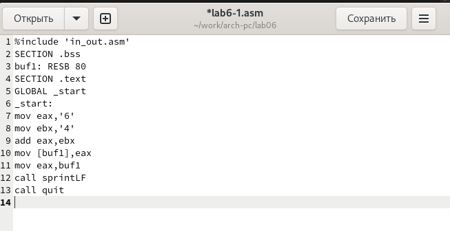

---
## Front matter
title: "Отчёт по лабораторной работе №6"
subtitle: "Дисциплина: архитектура компьютера"
author: "Репкина Елизавета Андреевна"

## Generic otions
lang: ru-RU
toc-title: "Содержание"

## Bibliography
bibliography: bib/cite.bib
csl: pandoc/csl/gost-r-7-0-5-2008-numeric.csl

## Pdf output format
toc: true # Table of contents
toc-depth: 2
lof: true # List of figures
lot: true # List of tables
fontsize: 12pt
linestretch: 1.5
papersize: a4
documentclass: scrreprt
## I18n polyglossia
polyglossia-lang:
  name: russian
  options:
	- spelling=modern
	- babelshorthands=true
polyglossia-otherlangs:
  name: english
## I18n babel
babel-lang: russian
babel-otherlangs: english
## Fonts
mainfont: IBM Plex Serif
romanfont: IBM Plex Serif
sansfont: IBM Plex Sans
monofont: IBM Plex Mono
mathfont: STIX Two Math
mainfontoptions: Ligatures=Common,Ligatures=TeX,Scale=0.94
romanfontoptions: Ligatures=Common,Ligatures=TeX,Scale=0.94
sansfontoptions: Ligatures=Common,Ligatures=TeX,Scale=MatchLowercase,Scale=0.94
monofontoptions: Scale=MatchLowercase,Scale=0.94,FakeStretch=0.9
mathfontoptions:
## Biblatex
biblatex: true
biblio-style: "gost-numeric"
biblatexoptions:
  - parentracker=true
  - backend=biber
  - hyperref=auto
  - language=auto
  - autolang=other*
  - citestyle=gost-numeric
## Pandoc-crossref LaTeX customization
figureTitle: "Рис."
tableTitle: "Таблица"
listingTitle: "Листинг"
lofTitle: "Список иллюстраций"
lotTitle: "Список таблиц"
lolTitle: "Листинги"
## Misc options
indent: true
header-includes:
  - \usepackage{indentfirst}
  - \usepackage{float} # keep figures where there are in the text
  - \floatplacement{figure}{H} # keep figures where there are in the text
---

# Цель работы

Цель данной лабораторной работы - освоение арифметческих инструкций
языка ассемблера NASM.

# Задание

1. Символьные и численные данные в NASM
2. Выполнение арифметических операций в NASM
3. Выполнение заданий для самостоятельной работы

# Теоретическое введение

Большинство инструкций на языке ассемблера требуют обработки операндов. Адрес операнда предоставляет место, где хранятся данные, подлежащие обработке. Это могут быть
данные хранящиеся в регистре или в ячейке памяти. Далее рассмотрены все существующие
способы задания адреса хранения операндов – способы адресации.
Существует три основных способа адресации:
• Регистровая адресация – операнды хранятся в регистрах и в команде используются
имена этих регистров, например: mov ax,bx.
• Непосредственная адресация – значение операнда задается непосредственно в команде, Например: mov ax,2.
• Адресация памяти – операнд задает адрес в памяти. В команде указывается символическое обозначение ячейки памяти, над содержимым которой требуется выполнить
операцию.
Схема команды целочисленного сложения add (от англ. addition - добавление) выполняет
сложение двух операндов и записывает результат по адресу первого операнда. Команда add
работает как с числами со знаком, так и без знака и выглядит следующим образом:
add <операнд_1>, <операнд_2>
Допустимые сочетания операндов для команды add аналогичны сочетаниям операндов
для команды mov.
Так, например, команда add eax,ebx прибавит значение из регистра eax к значению из
регистра ebx и запишет результат в регистр eax.
Команда целочисленного вычитания sub (от англ. subtraction – вычитание) работает аналогично команде add и выглядит следующим образом:
sub <операнд_1>, <операнд_2>
Так, например, команда sub ebx,5 уменьшает значение регистра ebx на 5 и записывает
результат в регистр ebx
Довольно часто при написании программ встречается операция прибавления или вычитания единицы. Прибавление единицы называется инкрементом, а вычитание — декрементом.
Для этих операций существуют специальные команды: inc (от англ. increment) и dec (от англ.
decrement), которые увеличивают и уменьшают на 1 свой операнд.
Эти команды содержат один операнд и имеет следующий вид:
inc <операнд>
dec <операнд>
Операндом может быть регистр или ячейка памяти любого размера. Команды инкремента
и декремента выгодны тем, что они занимают меньше места, чем соответствующие команды
сложения и вычитания.
Так, например, команда inc ebx увеличивает значение регистра ebx на 1, а команда inc
ax уменьшает значение регистра ax на 1

# Выполнение лабораторной работы

Символьные и численные данные в NASM
Создаю каталог для программам лабораторной работы № 6, перехожу в него и
создаю файл lab6-1.asm: (рис. [-@fig:001])

{#fig:001 width=70%}

Копирую в текущий каталог файл in_out.asm , т.к. он
будет использоваться в других программах (рис. [-@fig:002])

{#fig:002 width=70%}

Открываю созданный файл lab6-1.asm, вставляю в него программу вывода
значения регистра eax (рис. [-@fig:003])

{#fig:003 width=70%}

Создаю исполняемый файл и запускаю его.(рис. [-@fig:004])

{#fig:004 width=70%}

В данном случае при выводе значения регистра eax мы ожидаем увидеть число 10. Однако
результатом будет символ j. Это происходит потому, что код символа 6 равен 00110110 в
двоичном представлении (или 54 в десятичном представлении), а код символа 4 – 00110100 (52). Команда add eax,ebx запишет в регистр eax сумму кодов – 01101010 (106), что в свою
очередь является кодом символа j 

Далее меняю текст программы и вместо символов, записываю в регистры числа (рис. [-@fig:005])

{#fig:005 width=70%}

Создаю исполняемый файл и запускаю его.рис. [-@fig:006])

{#fig:006 width=70%}

Код 10 в таблице ASCII соответствует символу "Line Feed" (LF)

Создаю файл lab6-2.asm в каталоге ~/work/arch-pc/lab06 (рис. [-@fig:007])

{#fig:007 width=70%}
 
ввожу в него текст программы из листинга 6.2. (рис. [-@fig:008])

{#fig:008 width=70%}

Создаю исполняемый файл и запускаю его. (рис. [-@fig:009])

{#fig:009 width=70%}

В результате работы программы мы получим число 106. В данном случае, как и в первом,
команда add складывает коды символов ‘6’ и ‘4’ (54+52=106). Однако, в отличии от программы
из листинга 6.1, функция iprintLF позволяет вывести число, а не символ, кодом которого
является это число.

Аналогично предыдущему примеру меняю символы на числа. (рис. [-@fig:010])

{#fig:010 width=70%}

Создаю исполняемый файл и запускаю его. (рис. [-@fig:011])

{#fig:011 width=70%}

Программа складывает не соответствующие символам коды в системе ASCII, а сами числа, поэтому вывод 10.

Заменяю в тексте программы функцию iprintLF на iprint (рис. [-@fig:012])

{#fig:012 width=70%}

Создаю исполняемый файл и запускаю его. (рис. [-@fig:013])

{#fig:013 width=70%}

IiprintLF – работает аналогично iprint, но при выводе на экран после числа добавляет
к символ перевода строки

 Выполнение арифметических операций в NASM
 
 Создайте файл lab6-3.asm (рис. [-@fig:014])

{#fig:014 width=70%}

Ввожу в созданный файл текст программы для вычисления значения выражения f(x) = (5 * 2 + 3)/3  (рис. [-@fig:015])

{#fig:015 width=70%}

Создаю исполняемый файл и запускаю его. (рис. [-@fig:016])

{#fig:016 width=70%}

Меняю текст программы для вычисления выражения f(x) = (4 * 6 + 2)/5  (рис. [-@fig:017])

{#fig:017 width=70%}

Создаю исполняемый файл и запускаю его. (рис. [-@fig:018])

{#fig:018 width=70%}

Произведя несложные математические вычисления, делаю вывод, что программа работает верно

Создаю файл variant.asm в каталоге ~/work/arch-pc/lab06 (рис. [-@fig:019])

{#fig:019 width=70%}

Ввожу в файл текст программы для вычисления варианта задания по номеру
студенческого билета (рис. [-@fig:020])

{#fig:020 width=70%}

Создаю исполняемый файл и запускаю его. (рис. [-@fig:021])

{#fig:021 width=70%}

Ответы на вопросы:
1. Какие строки листинга 6.4 отвечают за вывод на экран сообщения ‘Ваш вариант:’?

mov eax,rem
call sprint

2. Для чего используется следующие инструкции?
mov ecx, x
mov edx, 80
call sread

Инструкция mov ecx, x используется для загрузки адреса строки x в регистр ecx, что позволяет указать, куда будет помещена вводимая информация. Команда mov edx, 80 устанавливает максимальную длину вводимой строки, равную 80 байтам, в регистр edx. Затем, с помощью команды call sread, происходит вызов подпрограммы, которая отвечает за считывание данных с клавиатуры и запись их в указанный буфер.

3. Для чего используется инструкция “call atoi”?

Команда call atoi используется для вызова внешней подпрограммы, которая преобразует строку, содержащую символы в формате ASCII, в целое число. Результат этого преобразования записывается в регистр eax.

4. Какие строки листинга 6.4 отвечают за вычисления варианта?

xor edx,edx ; обнуление edx для корректной работы div
mov ebx,20 ; ebx = 20
div ebx ; eax = eax/20, edx - остаток от деления
inc edx ; edx = edx + 1

5. В какой регистр записывается остаток от деления при выполнении инструкции “div
ebx”?

При выполнении инструкции div ebx остаток от деления записывается в
регистр edx

6. Для чего используется инструкция “inc edx”?

Инструкция inc edx служит для увеличения значения, хранящегося в регистре edx, на единицу.

7. Какие строки листинга 6.4 отвечают за вывод на экран результата вычислений?

mov eax,edx
call iprintLF

Выполнение заданий для самостоятельной работы

Создаю файл lab6-task.asm (рис. [-@fig:022])

{#fig:022 width=70%}

Открываю созданный файл для редактирования, ввожу в него текст программы
для вычисления значения выражения (x/2 + 8) * 3 (Вариант 14) (рис. [-@fig:023])

{#fig:023 width=70%}

Создаю и запускаю исполняемый файл, подставляя туда значения x1 и x2 (рис. [-@fig:024])

{#fig:024 width=70%}

Произведя несложные математические вычисления, делаю вывод, что программа работает верно

Программа для вычисления значения выражения (x/2 + 8) * 3 

%include 'in_out.asm' ; подключение внешнего файла

SECTION .data

msg: DB 'Введите значение переменной x:' , 0

rem: DB 'Результат: ',  0

SECTION .bss

x: RESB 80

SECTION .text

GLOBAL _start

_start:

; ---- Вычисление выражения

mov eax, msg

call sprint

mov ecx, x

mov edx, 80

call sread

mov eax, x ; вызов подпрограммы преобразования

call atoi ; ASCII кода в число, 'eax=x'

mov ebx, 2

xor edx, edx

div ebx ; eax = x / 2

add eax, 8 ; eax = (x / 2) + 8

mov ebx, 3

mul ebx ; eax = ((x / 2) + 8) * 3

; ----запись результата вычисления в edi

mov edi, eax

; ---- Вывод результата на экран

mov eax,rem ; вызов подпрограммы печати

call sprint ; сообщения 'Результат:  '

mov eax,edi ; вызов подпрограммы печати значения

call iprintLF; из 'edi' в виде символов

call quit ; вызов подпрограммы завершения

# Выводы

При выполнении данной лабораторной работы я освоила арифметические
инструкции языка ассемблера NASM.

# Список литературы{.unnumbered}
1. GDB: The GNU Project Debugger. — URL: https://www.gnu.org/software/gdb/.
2. GNU Bash Manual. — 2016. — URL: https://www.gnu.org/software/bash/manual/.
3. Midnight Commander Development Center. — 2021. — URL: https://midnight-commander.
org/.
4. NASM Assembly Language Tutorials. — 2021. — URL: https://asmtutor.com/.
5. Newham C. Learning the bash Shell: Unix Shell Programming. — O’Reilly Media, 2005. —
354 с. — (In a Nutshell). — ISBN 0596009658. — URL: http://www.amazon.com/Learningbash-Shell-Programming-Nutshell/dp/0596009658.
6. Robbins A. Bash Pocket Reference. — O’Reilly Media, 2016. — 156 с. — ISBN 978-1491941591.
7. The NASM documentation. — 2021. — URL: https://www.nasm.us/docs.php.
8. Zarrelli G. Mastering Bash. — Packt Publishing, 2017. — 502 с. — ISBN 9781784396879.
9. Колдаев В. Д., Лупин С. А. Архитектура ЭВМ. — М. : Форум, 2018.
10. Куляс О. Л., Никитин К. А. Курс программирования на ASSEMBLER. — М. : Солон-Пресс,
2017.
11. Новожилов О. П. Архитектура ЭВМ и систем. — М. : Юрайт, 2016.
12. Расширенный ассемблер: NASM. — 2021. — URL: https://www.opennet.ru/docs/RUS/nasm/.
13. Робачевский А., Немнюгин С., Стесик О. Операционная система UNIX. — 2-е изд. — БХВПетербург, 2010. — 656 с. — ISBN 978-5-94157-538-1.
14. Столяров А. Программирование на языке ассемблера NASM для ОС Unix. — 2-е изд. —
М. : МАКС Пресс, 2011. — URL: http://www.stolyarov.info/books/asm_unix.
15. Таненбаум Э. Архитектура компьютера. — 6-е изд. — СПб. : Питер, 2013. — 874 с. —
(Классика Computer Science).
16. Таненбаум Э., Бос Х. Современные операционные системы. — 4-е изд. — СПб. : Питер,
2015. — 1120 с. — (Классика Computer Science).

::: {#refs}
:::
