---
## Front matter
title: "Отчёт по лабораторной работе №7"
subtitle: "Дисциплина: архитектура компьютера"
author: "Репкина Елизавета Андреевна"

## Generic otions
lang: ru-RU
toc-title: "Содержание"

## Bibliography
bibliography: bib/cite.bib
csl: pandoc/csl/gost-r-7-0-5-2008-numeric.csl

## Pdf output format
toc: true # Table of contents
toc-depth: 2
lof: true # List of figures
lot: true # List of tables
fontsize: 12pt
linestretch: 1.5
papersize: a4
documentclass: scrreprt
## I18n polyglossia
polyglossia-lang:
  name: russian
  options:
	- spelling=modern
	- babelshorthands=true
polyglossia-otherlangs:
  name: english
## I18n babel
babel-lang: russian
babel-otherlangs: english
## Fonts
mainfont: IBM Plex Serif
romanfont: IBM Plex Serif
sansfont: IBM Plex Sans
monofont: IBM Plex Mono
mathfont: STIX Two Math
mainfontoptions: Ligatures=Common,Ligatures=TeX,Scale=0.94
romanfontoptions: Ligatures=Common,Ligatures=TeX,Scale=0.94
sansfontoptions: Ligatures=Common,Ligatures=TeX,Scale=MatchLowercase,Scale=0.94
monofontoptions: Scale=MatchLowercase,Scale=0.94,FakeStretch=0.9
mathfontoptions:
## Biblatex
biblatex: true
biblio-style: "gost-numeric"
biblatexoptions:
  - parentracker=true
  - backend=biber
  - hyperref=auto
  - language=auto
  - autolang=other*
  - citestyle=gost-numeric
## Pandoc-crossref LaTeX customization
figureTitle: "Рис."
tableTitle: "Таблица"
listingTitle: "Листинг"
lofTitle: "Список иллюстраций"
lotTitle: "Список таблиц"
lolTitle: "Листинги"
## Misc options
indent: true
header-includes:
  - \usepackage{indentfirst}
  - \usepackage{float} # keep figures where there are in the text
  - \floatplacement{figure}{H} # keep figures where there are in the text
---

# Цель работы

Изучение команд условного и безусловного переходов. Приобретение навыков написания
программ с использованием переходов. Знакомство с назначением и структурой файла
листинга.

# Задание

1. Реализация переходов в NASM
2. Изучение структуры файлы листинга
3. Выполнение заданий для самостоятельной работы

# Теоретическое введение

Для реализации ветвлений в ассемблере используются так называемые команды передачи
управления или команды перехода. Можно выделить 2 типа переходов:
• условный переход – выполнение или не выполнение перехода в определенную точку
программы в зависимости от проверки условия.
• безусловный переход – выполнение передачи управления в определенную точку программы без каких-либо условий
Команды безусловного перехода
Безусловный переход выполняется инструкцией jmp (от англ. jump – прыжок), которая
включает в себя адрес перехода, куда следует передать управление:
jmp <адрес_перехода>
Адрес перехода может быть либо меткой, либо адресом области памяти, в которую предварительно помещен указатель перехода. Кроме того, в качестве операнда можно использовать имя регистра, в таком случае переход будет осуществляться по адресу, хранящемуся в этом регистре.
Команды условного перехода
Как отмечалось выше, для условного перехода необходима проверка какого-либо условия.
В ассемблере команды условного перехода вычисляют условие перехода анализируя флаги из регистра флагов

# Выполнение лабораторной работы

1. Реализация переходов в NASM
Создаю каталог для программ лабораторной работы № 7, перехожу в него и создаю файл lab7-1.asm (рис. [-@fig:001])

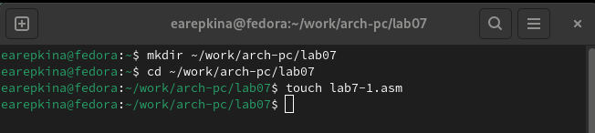{#fig:001 width=70%}

Ввожу в файл lab7-1.asm текст программы из листинга 7.1. (рис. [-@fig:002])

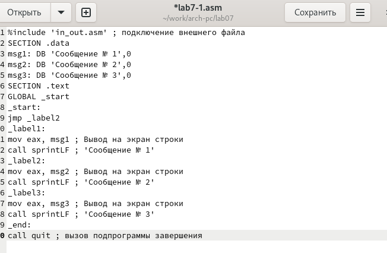{#fig:002 width=70%}

Создаю исполняемый файл и запускаю его.(рис. [-@fig:003])

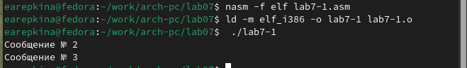{#fig:003 width=70%}

Изменяю текст программы в соответствии с листингом 7.2.(рис. [-@fig:004])

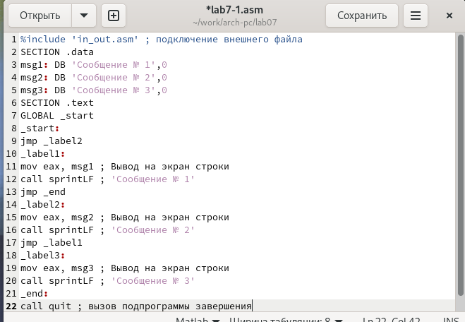{#fig:004 width=70%}

Создаю исполняемый файл и запускаю его.(рис. [-@fig:005])

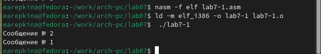{#fig:005 width=70%}

Изменяю текст программы добавив или изменив инструкции jmp (рис. [-@fig:006])

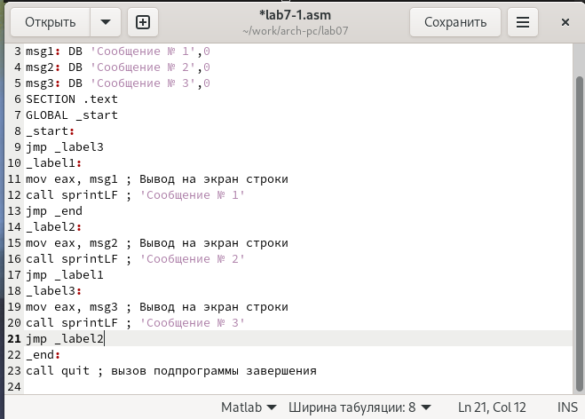{#fig:006 width=70%}

Создаю исполняемый файл и запускаю его.(рис. [-@fig:007])

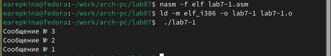{#fig:007 width=70%}

Создаю файл с названием lab7-2.asm  (рис. [-@fig:008])

{#fig:008 width=70%}

ввожу в него текст программы из листинга 7.3 (рис. [-@fig:009])

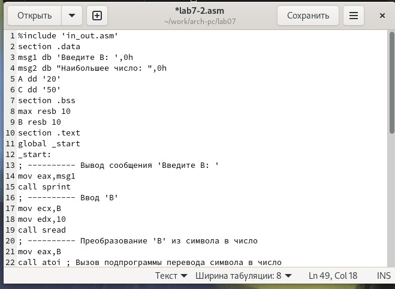{#fig:009 width=70%}

Создаю исполняемый файл и запускаю его. (рис. [-@fig:010])

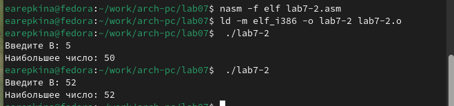{#fig:010 width=70%}

При введении числа до 50, программа выводит наибольшее число 50, при введении числа больше 50, программа выводит введенное нами число.

2. Изучение структуры файлы листинга

Создаю файл листинга для программы из файла (рис. [-@fig:011])

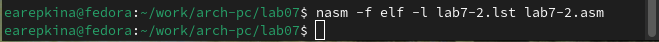{#fig:011 width=70%}

Открываю файл листинга lab7-2.lst с помощью любого текстового редактора, например
mcedit (рис. [-@fig:012])

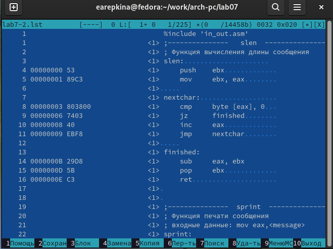{#fig:012 width=70%}

Объяснение содержимого строк:
Опишу строчку номер 16:
Здесь “15”-это номер строчки в коде программы “0000000D”- это адрес “5В”-
это машинный код “ret” - исходный кол программы
Опишу строчку номер 36:
Здесь “35”-это номер строчки в коде программы “00000027”- это адрес “CD80”-
это машинный код “int” - исходный кол программы
Опишу строчку номер 24:
Здесь “23”-это номер строчки в коде программы “0000000F”- это адрес “52”-
это машинный код “push” - исходный кол программы

Открываю файл с программой lab7-2.asm и в любой инструкции с двумя операндами
удаляю  один операнд. (рис. [-@fig:013])

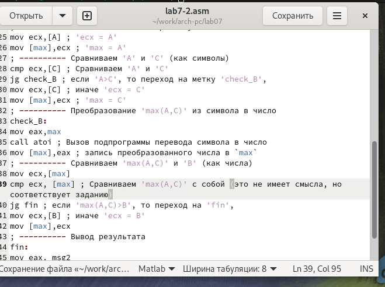{#fig:013 width=70%}

Пытаюсь создать файл листинга, но он не создается из-за ошибки

 Задание для самостоятельной работы
 
1. Создаю файл lab7-3.asm,пишу программу для нахождения наименьшего из 3 переменных(14 вариант исходя из 6 лабораторной) (рис. [-@fig:014])

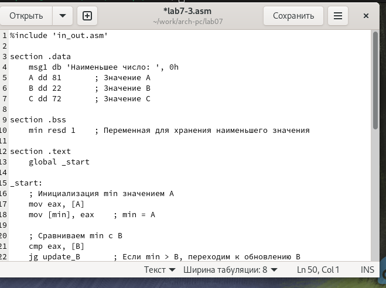{#fig:014 width=70%}

Проверяю работу программы,программа работает верно. (рис. [-@fig:015])

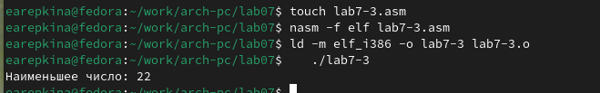{#fig:015 width=70%}

2. Создаю файл с названием lab7-4.asm, пишу программу для вычисления f(x),пишу программу для функции исходя из своего варианта, полученного в ходе
лабораторной работы номер 6,номер моего варианта 14 (рис. [-@fig:016])

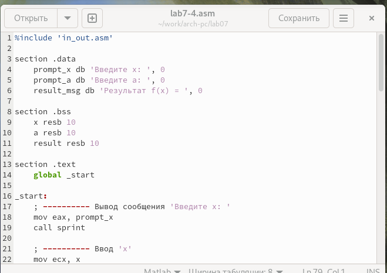{#fig:016 width=70%}
 
Создаю исполняемый файл и запускаю его. (рис. [-@fig:017])

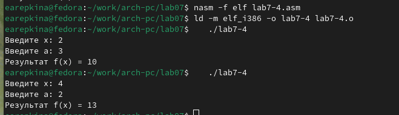{#fig:017 width=70%}

Произведя несложные математические вычисления, делаю вывод, что программа работает верно

# Выводы

В результате выполнения данной лабораторной работы, я изучила команды
условного и безусловного переходов, приобрела навыки написания программ с
использованием переходов и познакомилась с назначением и структурой файла
листинга

# Список литературы{.unnumbered}
1. GDB: The GNU Project Debugger. — URL: https://www.gnu.org/software/gdb/.
2. GNU Bash Manual. — 2016. — URL: https://www.gnu.org/software/bash/manual/.
3. Midnight Commander Development Center. — 2021. — URL: https://midnight-commander.
org/.
4. NASM Assembly Language Tutorials. — 2021. — URL: https://asmtutor.com/.
5. Newham C. Learning the bash Shell: Unix Shell Programming. — O’Reilly Media, 2005. —
354 с. — (In a Nutshell). — ISBN 0596009658. — URL: http://www.amazon.com/Learningbash-Shell-Programming-Nutshell/dp/0596009658.
6. Robbins A. Bash Pocket Reference. — O’Reilly Media, 2016. — 156 с. — ISBN 978-1491941591.
7. The NASM documentation. — 2021. — URL: https://www.nasm.us/docs.php.
8. Zarrelli G. Mastering Bash. — Packt Publishing, 2017. — 502 с. — ISBN 9781784396879.
9. Колдаев В. Д., Лупин С. А. Архитектура ЭВМ. — М. : Форум, 2018.
10. Куляс О. Л., Никитин К. А. Курс программирования на ASSEMBLER. — М. : Солон-Пресс,
2017.
11. Новожилов О. П. Архитектура ЭВМ и систем. — М. : Юрайт, 2016.
12. Расширенный ассемблер: NASM. — 2021. — URL: https://www.opennet.ru/docs/RUS/nasm/.
13. Робачевский А., Немнюгин С., Стесик О. Операционная система UNIX. — 2-е изд. — БХВПетербург, 2010. — 656 с. — ISBN 978-5-94157-538-1.
14. Столяров А. Программирование на языке ассемблера NASM для ОС Unix. — 2-е изд. —
М. : МАКС Пресс, 2011. — URL: http://www.stolyarov.info/books/asm_unix.
15. Таненбаум Э. Архитектура компьютера. — 6-е изд. — СПб. : Питер, 2013. — 874 с. —
(Классика Computer Science).
16. Таненбаум Э., Бос Х. Современные операционные системы. — 4-е изд. — СПб. : Питер,
2015. — 1120 с. — (Классика Computer Science).

::: {#refs}
:::
