---
## Front matter
title: "Отчёт по лабораторной работе №8"
subtitle: "Дисциплина: архитектура компьютера"
author: "Репкина Елизавета Андреевна"

## Generic otions
lang: ru-RU
toc-title: "Содержание"

## Bibliography
bibliography: bib/cite.bib
csl: pandoc/csl/gost-r-7-0-5-2008-numeric.csl

## Pdf output format
toc: true # Table of contents
toc-depth: 2
lof: true # List of figures
lot: true # List of tables
fontsize: 12pt
linestretch: 1.5
papersize: a4
documentclass: scrreprt
## I18n polyglossia
polyglossia-lang:
  name: russian
  options:
	- spelling=modern
	- babelshorthands=true
polyglossia-otherlangs:
  name: english
## I18n babel
babel-lang: russian
babel-otherlangs: english
## Fonts
mainfont: IBM Plex Serif
romanfont: IBM Plex Serif
sansfont: IBM Plex Sans
monofont: IBM Plex Mono
mathfont: STIX Two Math
mainfontoptions: Ligatures=Common,Ligatures=TeX,Scale=0.94
romanfontoptions: Ligatures=Common,Ligatures=TeX,Scale=0.94
sansfontoptions: Ligatures=Common,Ligatures=TeX,Scale=MatchLowercase,Scale=0.94
monofontoptions: Scale=MatchLowercase,Scale=0.94,FakeStretch=0.9
mathfontoptions:
## Biblatex
biblatex: true
biblio-style: "gost-numeric"
biblatexoptions:
  - parentracker=true
  - backend=biber
  - hyperref=auto
  - language=auto
  - autolang=other*
  - citestyle=gost-numeric
## Pandoc-crossref LaTeX customization
figureTitle: "Рис."
tableTitle: "Таблица"
listingTitle: "Листинг"
lofTitle: "Список иллюстраций"
lotTitle: "Список таблиц"
lolTitle: "Листинги"
## Misc options
indent: true
header-includes:
  - \usepackage{indentfirst}
  - \usepackage{float} # keep figures where there are in the text
  - \floatplacement{figure}{H} # keep figures where there are in the text
---

# Цель работы

Приобретение навыков написания программ с использованием циклов и обработкой
аргументов командной строки.

# Задание

1. Реализация циклов в NASM
2. Обработка аргументов командной строки
3. Задания для самостоятельной работы

# Теоретическое введение

Стек — это структура данных, организованная по принципу LIFO («Last In — First Out»
или «последним пришёл — первым ушёл»). Стек является частью архитектуры процессора и
реализован на аппаратном уровне. Для работы со стеком в процессоре есть специальные
регистры (ss, bp, sp) и команды.
Основной функцией стека является функция сохранения адресов возврата и передачи
аргументов при вызове процедур. Кроме того, в нём выделяется память для локальных
переменных и могут временно храниться значения регистров.
На рис. 8.1 показана схема организации стека в процессоре.
Стек имеет вершину, адрес последнего добавленного элемента, который хранится в регистре esp (указатель стека). Противоположный конец стека называется дном. Значение,
помещённое в стек последним, извлекается первым. При помещении значения в стек указатель стека уменьшается, а при извлечении — увеличивается.
Для стека существует две основные операции:
• добавление элемента в вершину стека (push);
• извлечение элемента из вершины стека (pop).
Добавление элемента в стек.
Команда push размещает значение в стеке, т.е. помещает значение в ячейку памяти, на
которую указывает регистр esp, после этого значение регистра esp увеличивается на 4.
Данная команда имеет один операнд — значение, которое необходимо поместить в стек.
Существует ещё две команды для добавления значений в стек. Это команда pusha, которая
помещает в стек содержимое всех регистров общего назначения в следующем порядке: ах,
сх, dx, bх, sp, bp, si, di. А также команда pushf, которая служит для перемещения в стек
содержимого регистра флагов. Обе эти команды не имеют операндов.
Извлечение элемента из стека.
Команда pop извлекает значение из стека, т.е. извлекает значение из ячейки памяти, на
которую указывает регистр esp, после этого уменьшает значение регистра esp на 4. У этой
команды также один операнд, который может быть регистром или переменной в памяти.
Нужно помнить, что извлечённый из стека элемент не стирается из памяти и остаётся как
“мусор”, который будет перезаписан при записи нового значения в стек.
Аналогично команде записи в стек существует команда popa, которая восстанавливает
из стека все регистры общего назначения, и команда popf для перемещения значений из
вершины стека в регистр флагов.

# Выполнение лабораторной работы

1. Реализация циклов в NASM
Создаю каталог для программам лабораторной работы № 8, перехожу в него и создаю файл lab8-1.asm (рис. [-@fig:001])

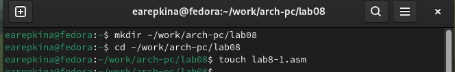{#fig:001 width=70%}

Ввожу в файл lab8-1.asm текст программы из листинга 8.1. (рис. [-@fig:002])

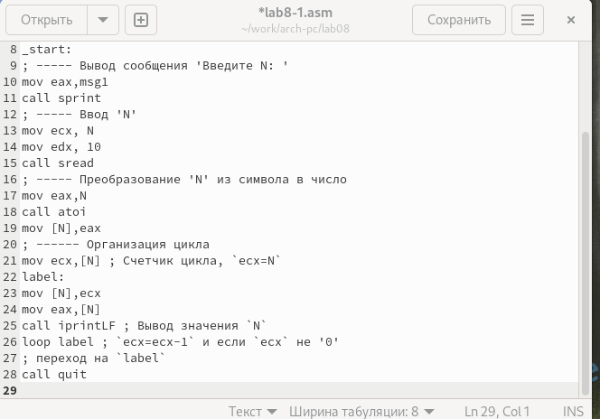{#fig:002 width=70%}

Создаю исполняемый файл и запускаю его.(рис. [-@fig:003])

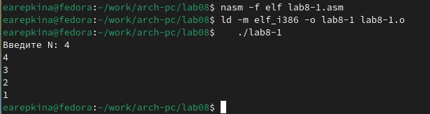{#fig:003 width=70%}

Данный пример показывает, что использование регистра ecx в теле цилка loop может
привести к некорректной работе программы.

Меняю текст программы добавив изменение значение регистра ecx в цикле (рис. [-@fig:004])

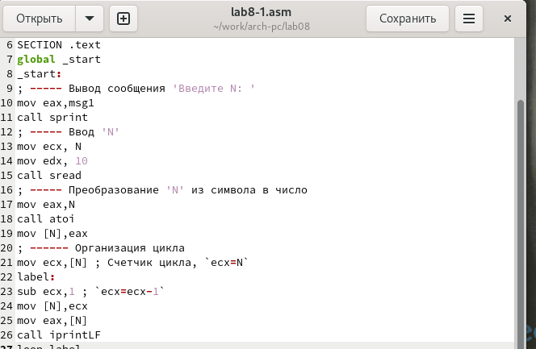{#fig:004 width=70%}

Создаю исполняемый файл и запускаю его.(рис. [-@fig:005])

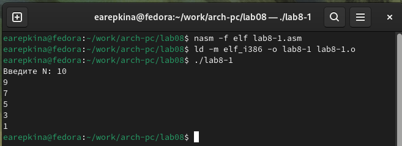{#fig:005 width=70%}

В данном случае число проходов цикла не соответствует значению N.

Вношу изменения в текст программы, добавив команды push и pop(рис. [-@fig:006])

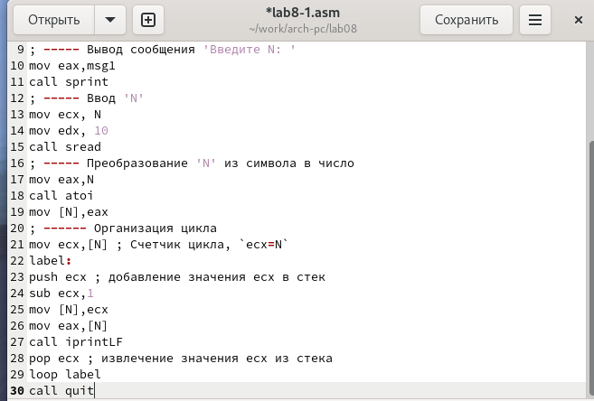{#fig:006 width=70%}

Создаю исполняемый файл и запускаю его.(рис. [-@fig:007])

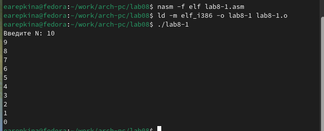{#fig:007 width=70%}

В данном случае число проходов цикла соответствует значению N.

2. Обработка аргументов командной строки

Создаю файл с названием lab8-2.asm  (рис. [-@fig:008])

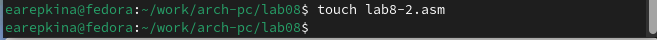{#fig:008 width=70%}

ввожу в него текст программы из листинга 8.2 (рис. [-@fig:009])

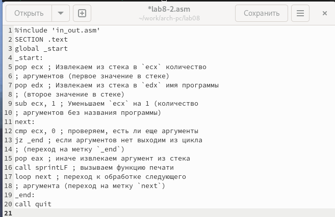{#fig:009 width=70%}

Создаю исполняемый файл и запускаю его, указав аргументы (рис. [-@fig:010])

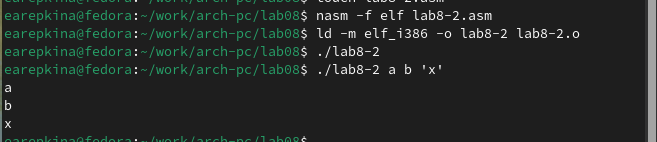{#fig:010 width=70%}

Программа обработала 3 аргумента.

Создаю файл lab8-3.asm (рис. [-@fig:011])

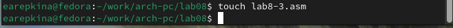{#fig:011 width=70%}

ввожу в него программу из листинга 8.3 (рис. [-@fig:012])

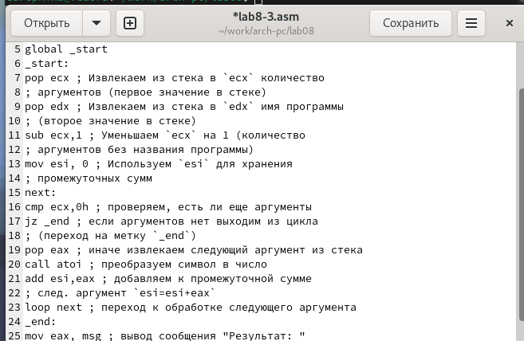{#fig:012 width=70%}

Создаю исполняемый файл и запускаю его, указав аргументы (рис. [-@fig:013])

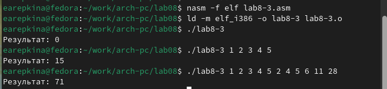{#fig:013 width=70%}

Программа работает.

Теперь изменяю текст программы из листинга 8.3 так, чтобы она вычисляла произведение агрументов каждой строки (рис. [-@fig:014])

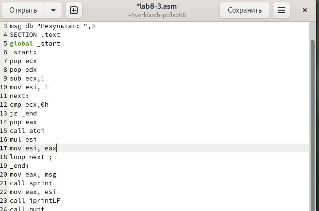{#fig:014 width=70%}

Создаю исполняемый файл и запускаю его, указав аргументы (рис. [-@fig:015])

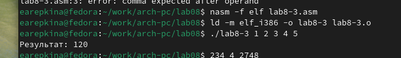{#fig:015 width=70%}

3. Задания для самостоятельной работы

Создаю файл lab8-task.asm (рис. [-@fig:016])

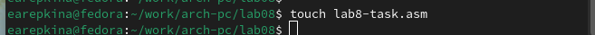{#fig:016 width=70%}

Начинаю написание программы, которая будет вычислять сумму значений f(x)=7(x+1).(вариант 14) (рис. [-@fig:017])

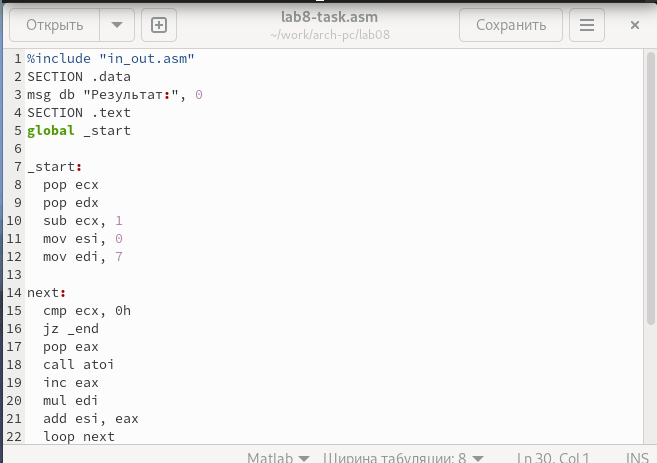{#fig:017 width=70%}

Создаю исполняемый файл и запускаю его. (рис. [-@fig:018])

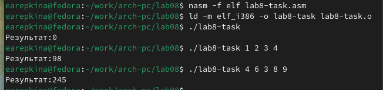{#fig:018 width=70%}

Произведя несложные математические вычисления, делаю вывод, что программа работает верно

Текст программы:

%include "in_out.asm" 

SECTION .data

msg db "Результат:", 0

SECTION .text

global _start

_start:

pop ecx

pop edx

sub ecx, 1

mov esi, 0

mov edi, 7

next:

cmp ecx, 0h

jz _end

pop eax

call atoi

inc eax

mul edi

add esi, eax

loop next

_end:

mov eax, msg

call sprint

mov eax, esi

call iprintLF

call quit

# Выводы

После выполнения данной лабораторной работы я приобрелa навыки написание программ с использованием циклов и обработкой агрументов командной строки

# Список литературы{.unnumbered}

::: {#refs}
:::
