---
## Front matter
title: "Отчёт по лабораторной работе №9"
subtitle: "Дисциплина: архитектура компьютера"
author: "Репкина Елизавета Андреевна"

## Generic otions
lang: ru-RU
toc-title: "Содержание"

## Bibliography
bibliography: bib/cite.bib
csl: pandoc/csl/gost-r-7-0-5-2008-numeric.csl

## Pdf output format
toc: true # Table of contents
toc-depth: 2
lof: true # List of figures
lot: true # List of tables
fontsize: 12pt
linestretch: 1.5
papersize: a4
documentclass: scrreprt
## I18n polyglossia
polyglossia-lang:
  name: russian
  options:
	- spelling=modern
	- babelshorthands=true
polyglossia-otherlangs:
  name: english
## I18n babel
babel-lang: russian
babel-otherlangs: english
## Fonts
mainfont: IBM Plex Serif
romanfont: IBM Plex Serif
sansfont: IBM Plex Sans
monofont: IBM Plex Mono
mathfont: STIX Two Math
mainfontoptions: Ligatures=Common,Ligatures=TeX,Scale=0.94
romanfontoptions: Ligatures=Common,Ligatures=TeX,Scale=0.94
sansfontoptions: Ligatures=Common,Ligatures=TeX,Scale=MatchLowercase,Scale=0.94
monofontoptions: Scale=MatchLowercase,Scale=0.94,FakeStretch=0.9
mathfontoptions:
## Biblatex
biblatex: true
biblio-style: "gost-numeric"
biblatexoptions:
  - parentracker=true
  - backend=biber
  - hyperref=auto
  - language=auto
  - autolang=other*
  - citestyle=gost-numeric
## Pandoc-crossref LaTeX customization
figureTitle: "Рис."
tableTitle: "Таблица"
listingTitle: "Листинг"
lofTitle: "Список иллюстраций"
lotTitle: "Список таблиц"
lolTitle: "Листинги"
## Misc options
indent: true
header-includes:
  - \usepackage{indentfirst}
  - \usepackage{float} # keep figures where there are in the text
  - \floatplacement{figure}{H} # keep figures where there are in the text
---

# Цель работы

Приобретение навыков написания программ с использованием подпрограмм.
Знакомство с методами отладки при помощи GDB и его основными возможностями

# Задание

1. Релизация подпрограмм в NASM
2. Отладка программ с помощью GDB
3. Добавление точек останова
4. Работа с данными программы в GDB
5. Обработка аргументов командной строки в GDB
6. Задание для самостоятельной работы.

# Теоретическое введение

 Понятие об отладке

Отладка — это процесс поиска и исправления ошибок в программе. В общем случае его
можно разделить на четыре этапа:

• обнаружение ошибки;

• поиск её местонахождения;

• определение причины ошибки;

• исправление ошибки.

Можно выделить следующие типы ошибок:

• синтаксические ошибки — обнаруживаются во время трансляции исходного кода и
вызваны нарушением ожидаемой формы или структуры языка;

• семантические ошибки — являются логическими и приводят к тому, что программа
запускается, отрабатывает, но не даёт желаемого результата;

• ошибки в процессе выполнения — не обнаруживаются при трансляции и вызывают прерывание выполнения программы (например, это ошибки, связанные с переполнением
или делением на ноль).

Второй этап — поиск местонахождения ошибки. Некоторые ошибки обнаружить довольно трудно. Лучший способ найти место в программе, где находится ошибка, это разбить
программу на части и произвести их отладку отдельно друг от друга.

Третий этап — выяснение причины ошибки. После определения местонахождения ошибки
обычно проще определить причину неправильной работы программы.

Последний этап — исправление ошибки. После этого при повторном запуске программы,
может обнаружиться следующая ошибка, и процесс отладки начнётся заново.
 
 
 Методы отладки

Наиболее часто применяют следующие методы отладки:

• создание точек контроля значений на входе и выходе участка программы (например,
вывод промежуточных значений на экран — так называемые диагностические сообщения);

• использование специальных программ-отладчиков.

Отладчики позволяют управлять ходом выполнения программы, контролировать и изменять данные. Это помогает быстрее найти место ошибки в программе и ускорить её исправление. Наиболее популярные способы работы с отладчиком — это использование точек останова и выполнение программы по шагам.
Пошаговое выполнение — это выполнение программы с остановкой после каждой строчки, чтобы программист мог проверить значения переменных и выполнить другие действия.
Точки останова — это специально отмеченные места в программе, в которых программаотладчик приостанавливает выполнение программы и ждёт команд. Наиболее популярные виды точек останова:

• Breakpoint — точка останова (остановка происходит, когда выполнение доходит до
определённой строки, адреса или процедуры, отмеченной программистом);

• Watchpoint — точка просмотра (выполнение программы приостанавливается, если программа обратилась к определённой переменной: либо считала её значение, либо изменила его).

Точки останова устанавливаются в отладчике на время сеанса работы с кодом программы, т.е. они сохраняются до выхода из программы-отладчика или до смены отлаживаемой
программы.

# Выполнение лабораторной работы

 Реализация подпрограмм в NASM

Создаю каталог для выполнения лабораторной работы №9, перехожу в него и
создаю файл lab09-1.asm.(рис. [-@fig:001])

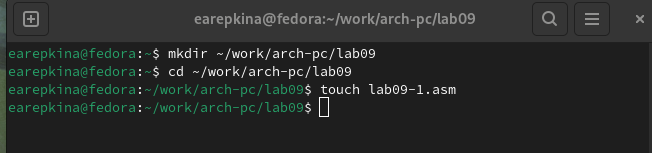{#fig:001 width=70%}

Ввожу в файл lab09-1.asm текст программы из листинга 9.1. (рис. [-@fig:002])

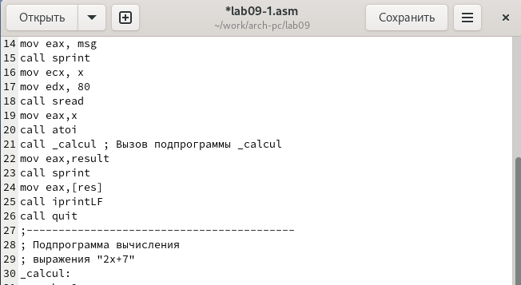{#fig:002 width=70%}

Создаю исполняемый файл и запускаю его.(рис. [-@fig:003])

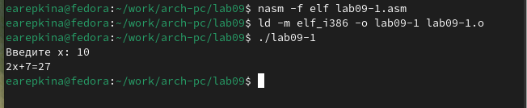{#fig:003 width=70%}

Изменяю текст программы, добавляя подпрограмму _subcalcul в подпрограммы _calcul (рис. [-@fig:004])

{#fig:004 width=70%}

Создаю исполняемый файл и запускаю его.(рис. [-@fig:005])

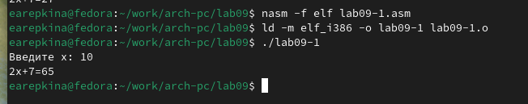{#fig:005 width=70%}

Программа работает корректно.

 Отладка программам с помощью GDB

Создаю файл lab09-2.asm с текстом программы из Листинга 9.2 (рис. [-@fig:006])

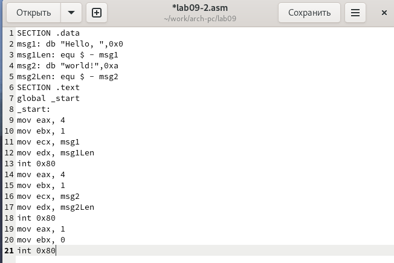{#fig:006 width=70%}

Получаю исполняемый файл.Для работы с GDB в исполняемый файл необходимо добавить отладочную информацию, для этого трансляцию программ
необходимо проводить с ключом ‘-g’.Далее загружаю исполняемый файл в отладчик gdb и запускаю его с помощью команды run.(рис. [-@fig:007])

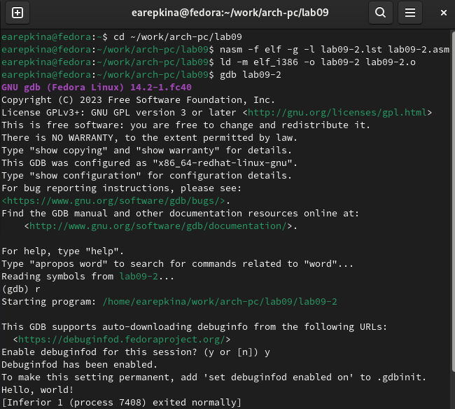{#fig:007 width=70%}

Устанавливаю брейкпоинт на метку _start и запукаю программу (рис. [-@fig:008])

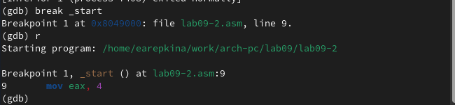{#fig:008 width=70%}

Смотрю дисассимилированный код программы с помощью команды disassemble начинаю с метки _start (рис. [-@fig:009])

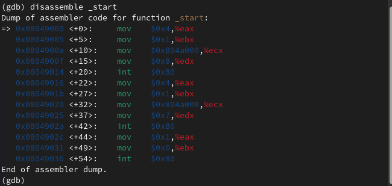{#fig:009 width=70%}

Переключаюсь на отображение команд с Intel’овским синтаксисом, введя команду set disassembly-flavor intel (рис. [-@fig:010])

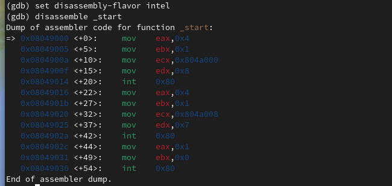{#fig:010 width=70%}

Отличия заключаются в том, что в режиме ATT используются “%” перед перед
именами регистров и “$” перед именами операндов, а в режиме Intel используется обычный синтаксис.
Включаю режим псевдографики для более удобного анализа программы(рис. [-@fig:011])

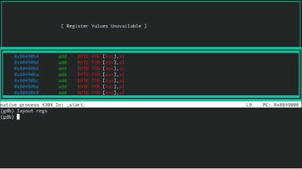{#fig:011 width=70%}

Добавление точек останова
Проверяю точку останова по имени метки (рис. [-@fig:012])

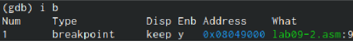{#fig:012 width=70%}

Определю адрес пердпоследней инструкции и устанавливаю точку останова.
Далее смотрю информацию о всех установленных точках останова (рис. [-@fig:013])

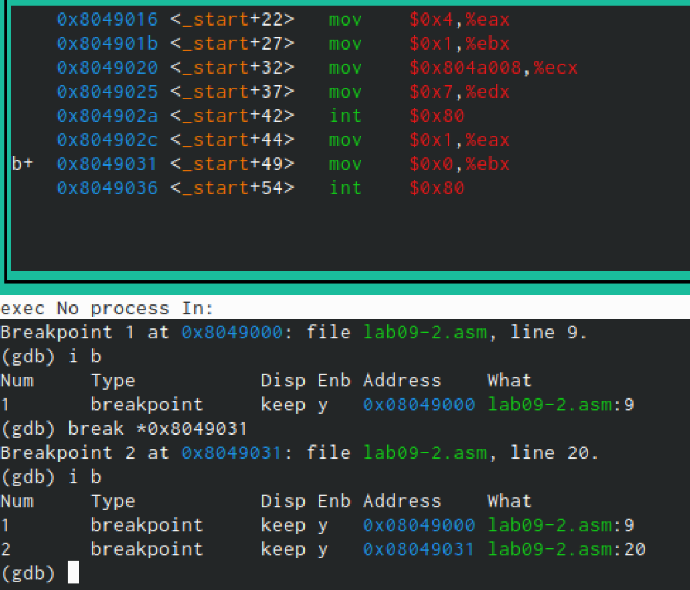{#fig:013 width=70%}

Работа с данными программы в GDB

Выполняю 5 инструкций с помощью команды stepi и слежу за изменением
регистров. (рис. [-@fig:014]) (рис. [-@fig:015])

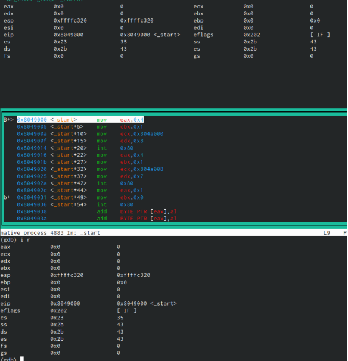{#fig:014 width=70%}

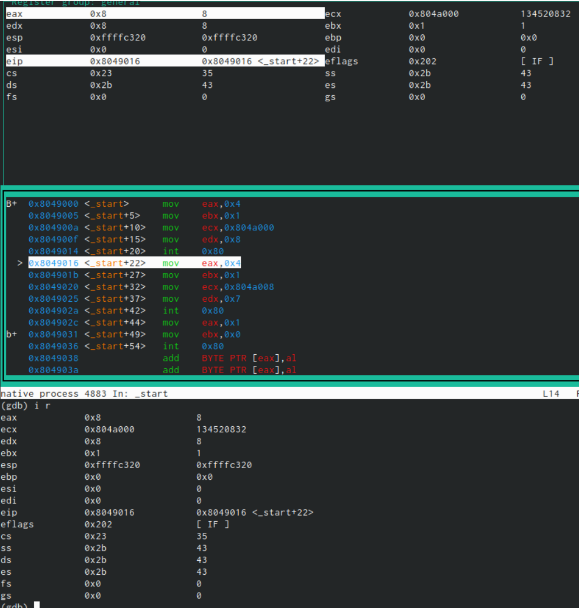{#fig:015 width=70%}

Изменились регистры eax,ebx,ecx,edx
Просматриваю значение переменной msg1 по имени (рис. [-@fig:016])

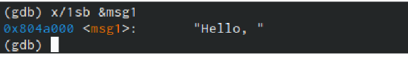{#fig:016 width=70%}

Также просматриваю значение переменной msg2 (рис. [-@fig:017])

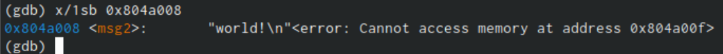{#fig:017 width=70%}

Изменяю первый символ переменной msg1 (рис. [-@fig:018])

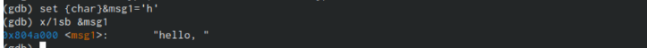{#fig:018 width=70%}

Изменяю первый символ переменной msg2. (рис. [-@fig:019])

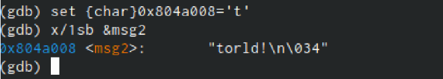{#fig:019 width=70%}

Вывожу в различных форматах значение регистра ebx (рис. [-@fig:020])

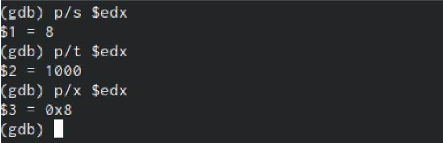{#fig:020 width=70%}

С помощью команды set изменяю значение регистра ebx(рис. [-@fig:021])

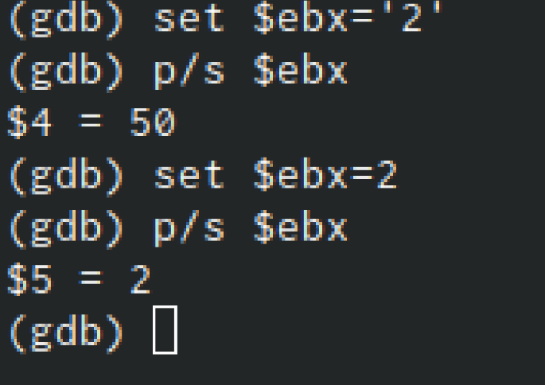{#fig:021 width=70%}

Обработка аргументов командной строки в GDB

Копирую файл lab8-2.asm, созданный при выполнении лабораторной работы №8, с программой выводящей на экран аргументы командной строки (Листинг 8.2) в файл с именем lab09-3.asm (рис. [-@fig:022])

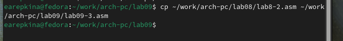{#fig:022 width=70%}

Создаю исполняемый файл (рис. [-@fig:023])

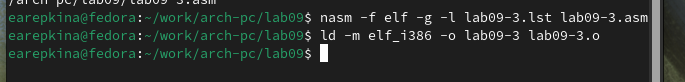{#fig:023 width=70%}

Загружаю исполняемый файл в отладчик, указав агрументы (рис. [-@fig:024])

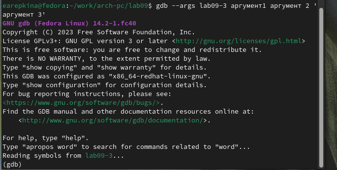{#fig:024 width=70%}

Для начала устанавливаю точку останова перед первой инструкцией в программе и запускаю её (рис. [-@fig:025])

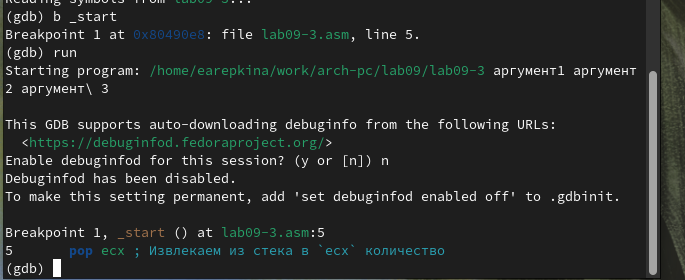{#fig:025 width=70%}

Просматриваю вершину стека, то есть число аргументов строки(включая имя программы)  (рис. [-@fig:026])

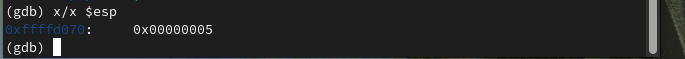{#fig:026 width=70%}

Просматриваю остальные позиции стека.  (рис. [-@fig:027])

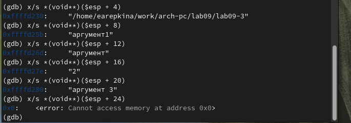{#fig:027 width=70%}

Шаг изменения адреа равен 4, потому что занчение регистра esp в стеке увели-
чивается на 4

 Задание для самостоятельной работы.
1. Открываю программу из лабораторной работы №8 и начинаю её редактировать (рис. [-@fig:028])

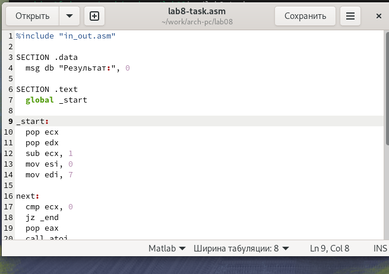{#fig:028 width=70%}

Создаю исполняемый файл и запускаю его, чтобы проверить работу программы (рис. [-@fig:029])

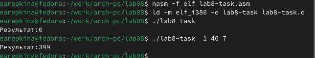{#fig:029 width=70%}

Программа работает верно.

Текст программы:

%include "in_out.asm"

SECTION .data

msg db "Результат:", 0

SECTION .text

global _start

_start:

pop ecx

pop edx

sub ecx, 1

mov esi, 0

mov edi, 7

next:

cmp ecx, 0

jz _end

pop eax

call atoi

call _f

add esi, eax

loop next

_end:

mov eax, msg

call sprint

mov eax, esi

call iprintLF

call quit

_f:

inc eax

mul edi

ret

2. Создаю файл  и ввожу туда текст программы из листинга 9.3 (рис. [-@fig:030])

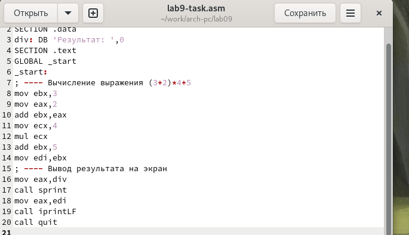{#fig:030 width=70%}

Создаю исполняемый файл и запускаю его, чтобы проверить работу программы (рис. [-@fig:031])

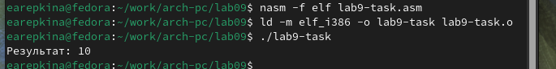{#fig:031 width=70%}

Убеждаюсь, что программа работает неверно.

Создаю исполняемый файл для работы с GDB и запускаю его через режим отладки. Создаю брейкпойнт и пошагово просматириваю программу (рис. [-@fig:032])

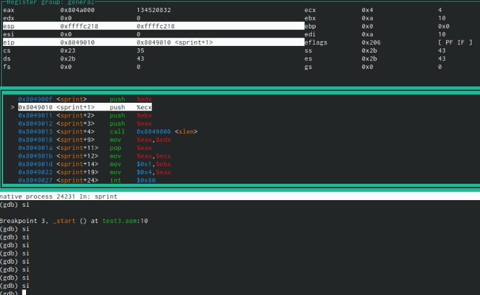{#fig:032 width=70%}

Замечаю, что после выполнения инструкции mul программы умножент 4 на 2 на не на 5, как должно быть.Из-за этого программа выдает неверный результат.

Далле открываю файл с программой и исправляю ошибку (рис. [-@fig:033])

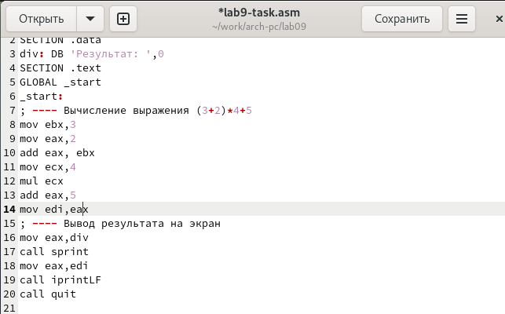{#fig:033 width=70%}

Создаю исполняемый файл и запускаю его, чтобы проверить работу программы (рис. [-@fig:034])

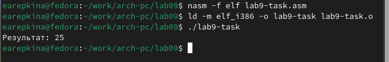{#fig:034 width=70%}

Теперь программа работает верно.

Текст программы:

%include ‘in_out.asm’

SECTION .data

div: DB ‘Результат:’,0

SECTION .text

GLOBAL _start

_start:

; —- Вычисление выражения (3+2)*4+5

mov ebx,3

mov eax,2

add eax,ebx

mov ecx,4

mul ecx

add eax,5

mov edi,eax

; —- Вывод результата на экран

mov eax,div

call sprint

mov eax,edi

call iprintLF

call quit

# Выводы

После выполнения данной лабораторной работы я приобрелa навыки написания программ с использование подпрограмм и познакомилась с методами отладки при помощи GDB и его основными возможностями.

# Список литературы{.unnumbered}

1. GDB: The GNU Project Debugger. — URL: https://www.gnu.org/software/gdb/.
2. GNU Bash Manual. — 2016. — URL: https://www.gnu.org/software/bash/manual/.
3. Midnight Commander Development Center. — 2021. — URL: https://midnight-commander.
org/.
4. NASM Assembly Language Tutorials. — 2021. — URL: https://asmtutor.com/.
5. Newham C. Learning the bash Shell: Unix Shell Programming. — O’Reilly Media, 2005. —
354 с. — (In a Nutshell). — ISBN 0596009658. — URL: http://www.amazon.com/Learningbash-Shell-Programming-Nutshell/dp/0596009658.
6. Robbins A. Bash Pocket Reference. — O’Reilly Media, 2016. — 156 с. — ISBN 978-1491941591.
7. The NASM documentation. — 2021. — URL: https://www.nasm.us/docs.php.
8. Zarrelli G. Mastering Bash. — Packt Publishing, 2017. — 502 с. — ISBN 9781784396879.
9. Колдаев В. Д., Лупин С. А. Архитектура ЭВМ. — М. : Форум, 2018.
10. Куляс О. Л., Никитин К. А. Курс программирования на ASSEMBLER. — М. : Солон-Пресс,
2017.
11. Новожилов О. П. Архитектура ЭВМ и систем. — М. : Юрайт, 2016.
12. Расширенный ассемблер: NASM. — 2021. — URL: https://www.opennet.ru/docs/RUS/nasm/.
13. Робачевский А., Немнюгин С., Стесик О. Операционная система UNIX. — 2-е изд. — БХВПетербург, 2010. — 656 с. — ISBN 978-5-94157-538-1.
14. Столяров А. Программирование на языке ассемблера NASM для ОС Unix. — 2-е изд. —
М. : МАКС Пресс, 2011. — URL: http://www.stolyarov.info/books/asm_unix.
15. Таненбаум Э. Архитектура компьютера. — 6-е изд. — СПб. : Питер, 2013. — 874 с. —
(Классика Computer Science).
16. Таненбаум Э., Бос Х. Современные операционные системы. — 4-е изд. — СПб. : Питер,
2015. — 1120 с. — (Классика Computer Science).

::: {#refs}
:::
